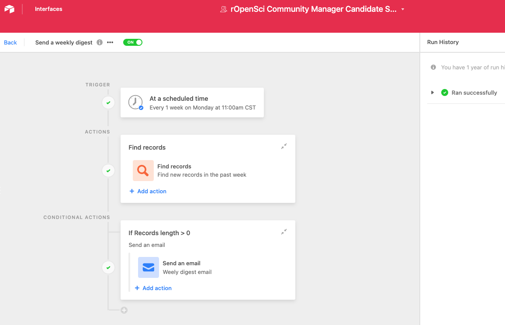

# Airtable {#airtable}

This chapter will provide an overview of Airtable and good practices for designing data models in relational databases. 

## Key Terms

- **Workspace** - A collection of bases
- **Base** - A database. Each is identified by the Airtable API via a `base id` 
- **Table** - A tabular data set within a base. Each table is identified by the Airtable API via the name of the table e.g. "Demo Table"
- **Record** - An individual cell within a table. Each record is identified by the Airtable API via a `record id`
- **Field** - A property of data in a table 
- **Views** - A specific way of displaying a table. Default is grid. 
- **Entity** - Something that either physically or logically exists whose properties are typically stored in a table and composed of data elements.
- **Element** - an attribute of a Entity (a field)

## What is Airtable?

Airtable provides a cloud hosted spreadsheet-database hybrid platform for collaborative data curation. The platform is designed to provide features of a relational database (SQL-Like) linked records with an easy-to-use spreadsheet interface. What is more, each database provides a data service that can be accessed via a secure application programming interface (API) by authorized users. This combination of features make Airtable an appropriate platform for people conducting data entry as well as people building technical infrastructure.  

## When should I use Airtable? 

Use Airtable when you would have multiple tabs in a spreadsheet, when you have hierarchical data, and/or when you want to create collaborative automated workflows in a low code environment. 

**Project Management**  
Because Airtable is extremely useful and user friendly, there are a plethora of pre-built templates for nearly an project management type task.  

- [Airtable Templates](https://www.airtable.com/templates)  
- [User Contributed Templates](https://www.airtable.com/universe)  

For example, the computational sciences team has had success using  Airtable for candidate searches. Airtable allows us to efficiently, independently, and consistently review applications then compare our ratings. We can then sort candidates by average score and reach a consensus on who to follow up with. 

**Research Data**  
Airtable shines when you have multiple data entities that are linked via common data elements. For example, if you are sampling bats then conducting antibody screening, running multiplex PCR, and keeping physical samples of blood and urine from those bats, you have multiple data entities (bats, antibody test results, PCR test results, and physical samples) that are all linked via common data elements like site and collector.
What is more, the test results depend on the physical samples and the physical samples depend on the bats. Those common data elements only need to be entered into a single entity (or table) then shared across the other entities in your base using linked elements. Once you have linked elements you no longer have to worry about updating the same piece of information in multiple locations and you can quickly navigate between entities and understand hierarchical relationships. 

```{r bat-data, echo=FALSE, fig.height=8, fig.cap="Data model for bat sampling example."}
DiagrammeR::grViz("
digraph bat_sampling {

  # a 'graph' statement
  graph [overlap = true, nodesep = .5, ranksep = .25, compound = true, color = MediumAquamarine, fontsize = 10, rankdir = LR]

  # 'node' styling
  node [shape = circle,
        fixedsize = true,
        width = 1,
        fontname = Helvetica,
        style = filled,
        fillcolor = MediumAquamarine]
        
  a [label = 'Collector']
  b [label = 'Site']
  c [label = 'Bat']
  d [label = 'Antibody\ntest result']
  e [label = 'PCR\ntest result']
  f [label = 'Physical\nsample']
  
  edge [color = grey, 
        arrowhead = none,
        arrowtail = none,
        penwidth = 3]
 
 a -> c [label = 'Collected by']
 b -> c [label = 'Collected at']
 c -> f [label = 'Collected from']
 f -> d [label = 'Derived from']
 f -> e [label = 'Derived from']
 
}
  
", height = 200)

```  


## Security and Access Control

Airtable maintains physical and technological security as part of its ISO IEC 27001:2013 and SOC 2 compliance measures.  Data are 256-bit encrypted when storing on the server and also when transferring data over the internet. To find vulnerabilities in their software, they run daily, weekly, and monthly scans on different components of their system and regularly commission external penetration tests. They also run a bug bounty program to help identify issues. Their data centers have fire detection and suppression systems, redundant power systems, and strict control for physical access. Because Airtable relies on Amazon Web Services (AWS) for its cloud infrastructure (the same providers used by previous EHA projects), data are geo-redundantly replicated in backups across multiple zones to increase data durability. They also have a team monitoring services at all times. Airtable employees are thoroughly vetted before hiring and continually trained on data protection best practices. Their workstations are secured by using full-disk encryption, automatic locking, and strong password requirements.  

### User- and Administrator Security Features
#### Access Controls

Airtable provides database (referred to as "base") and workspace administrators with granular controls over who can view, edit, comment, or otherwise modify data at the base, table, and field levels.  There are four levels of Airtable user permissions:  

- **Owner/Creator**: Full administrative control of base  
- **Editor**: Sees full base, create and modify records and views, create and modify view share links  
- **Commenter**:  Sees full base, comment on records  
- **Reader**: Sees full base  

Direct access to a base or workspace is granted or removed by base owners and creators to Airtable users. Base owners and creators can control who has access to a base and can control any “share” links created for that base. They may also restrict editing of tables or fields within a base. Any collaborator given direct access to a base at any permission level will be able to duplicate that base and share that data further. It is important that direct access to the base is limited to individuals with a need to curate or analyze the data. 
To further restrict access to a base, users can be given indirect access via revocable share links. These can be customized to prevent users from seeing the full base, prevent duplicating the base, and prevent copying data from the base. The ability to use the link can be password protected, restricted to people with certain email domains, and may be revoked at any time. If there are concerns about data leaks via base or table duplication, inviting people with a need to view the data via share links constrains their ability to extract data from the base.


## Data in Airtable

See [Airtable plan comparison](https://support.airtable.com/hc/en-us/articles/115010928147-Airtable-plans) for more information on the size of bases and features available. Information in this section pertains to all plans unless specified.  

### Workspaces, Bases, Tables, Fields, Records

Airtable uses workspaces, bases, tables, and fields to manage data. A workspace generally pertains to a particular project and contains all bases relevant to that project. Sharing a workspace with someone allows them to see all bases within that workspace. 

Bases are equivalent to databases. They consist of a set of tables that can be linked and allow you to perform some task (e.g. IRB tracking, capturing research data, etc.). Bases can be duplicated and shared across your workspaces and you can share bases with other users. 

Tables are where most of the action happens. Data is entered in tables, tables can be transformed via views into calendars, dashboards, or galleries, and tables can be manipulated via the API. They describe a data entity and are composed of fields. In the bat sampling example, each circle would be a table in the bat sampling base.

```{r echo=FALSE, fig.height=8, fig.cap="Data model for bat sampling example.", ref.label= "bat-data"}
```

Fields represent properties of a data entity. In a spreadsheet view, fields are columns. Airtable allows you to control field types (date, number, text, file attachments, logical, etc.) and paid plans allows you to control who can edit fields. Fields can be linked between tables creating links. 

Records are the individual data points in a table. In a spreadsheet they would be the rows. Records are shaped by the structure you have created in tables and fields. Each record has a URL that can be used to access it programatically or share it.    

### Views

In Airtable, tables can be displayed in different views to emphasis different components of the data. Views are great for creating concise presentations of data, especially in sprawling tables. The default view in an table is the grid (spreadsheet) view. All other views will derive from the data entered in this view. 

For more on views, see [the guide to views](https://support.airtable.com/hc/en-us/articles/202624989-Guide-to-views).

### Internal Backups: Record History, Base Snapshots

Airtable has system for tracking changes to a base. They provide revision history for individual records (how long those histories are stored varies by plan). Any comments made in the revision history will be stored for the life of the record (on any plan). The current state of an entire base may be captured through snapshots. Should a systemic issue arise, the base can be restored to a snapshot at a later date. Restoring from a snapshot will remove the revision history for a record but comments on that record will be maintained.   

As revision histories are maintained, "deleted" records may be retrieved.  In the event of the need to permanently remove data, the revision history of the base may be removed. 

Airtable allows data to be exported as CSVs from individual tables. At this time there is not an Airtable supported base export function. 

### Importing data

Data can be imported to Airtable from a number of sources including CSV files, excel, Google sheets, XML, and via copy paste. Airtable will guess what the most appropriate field type is, so make sure the field type is appropriate for the data (e.g. convert from text to date type fields). Certain sources, like Google sheets, can be imported as bases. 

For more on importing data see: [Importing and Adding data](https://support.airtable.com/hc/en-us/sections/200928025-Importing-and-adding-data) 

## Base Design

Having a good base design will make using your data easier. Generally, the process looks like this:

0) Describe what the database will do and collect use cases
1) Determine the roles of various stakeholders
1) List out the entities in the database and define their properties
2) Map out how  the entities fit together (which properties link them)
3) Check that the mapping meets the use cases
4) Build base in Airtable
5) Check that the base meets the use cases

If you are migrating from spreadsheets, you likely already have an idea of what you need the base to do and a collection of data properties. It is still a good idea to follow the steps outlined above for mapping out entities. You may find that entire sheets can be replaced by views or that the data in one sheet should actually be stored in two different tables.

Feel free to reach out to the data librarian for questions about base design.

## Automating Airtable

Airtable has five main routes for automating processes.

1) [Automations](https://support.airtable.com/hc/en-us/articles/360050974153-Automations-overview) - a drag and drop visual programming tool
2) [Extensions](https://support.airtable.com/docs/airtable-extensions-overview) - pre-built applications that perform some task
3) [Scripting](https://support.airtable.com/hc/en-us/articles/360043041074-Scripting-app-overview) - use JavaScript to automate tasks within Airtable
4) [Blocks](https://www.airtable.com/developers/apps/guides/getting-started) - use JavaScript to create custom applications
5) [REST API](https://airtable.com/api) - use whatever programming language you like to automate processes


### Automations with Drag and Drop Programing (pro and above)

The automations feature within Airtable allows you to visually program routines. Each automation has three basic components:

- Status - controls whether or not the automation will run when the trigger condition is met
- Triggers - condition for automation to run: the creation or change of a record, a scheduled time, or some other external action
- Actions - what the automation will do


```{r actions diagram, echo=FALSE,fig.height=1.5}

library(ggplot2)

nodes <- data.frame(x = c(1,2,3), y = 0, label = c("Status", "Trigger", "Action") )

edges <- data.frame(x1 = c(1,2), x2 = c(2,3), y1 = 0, y2 = 0, seg_label = c("Automation is On","Condition is Met"))


ggplot()+
  geom_segment(data = edges, aes(x = x1, y = y1, xend = x2, yend = y2), color = "light gray") +
    geom_text(data = edges, aes( label = seg_label),y = 0.005, x = c(1.5,2.5), size = 5) +
    geom_point( data = nodes, aes(x =x, y = y), size = 30,  color = "mediumaquamarine") +
  geom_text(data = nodes, aes(x =x, y=y, label = label), size = 5) +
  theme_void() +
  xlim(c(.9,3.1))
```

Automations are commonly used to augment the synced tables feature, send notifications, check data quality, and manipulate or create records. 

This automation creates a weekly summary of applicants who applied for a position. Its trigger is time based, then it finds records that match a condition, and finally it generates an email from those records and sends to the appropriate recipients. 



### Scripting and Blocks (pro plan and above)

Scripting uses JavaScript to manipulate a base from within an application in Airtable. Scripting is flexible but has a steep learning curve. The scripting environment Airtable provides can be helpful as it provides code [linting](https://en.wikipedia.org/wiki/Lint_(software)), direct access to documentation, and example scripts to build from. The major drawback to scripting is that scripts live in the base and files are not version controlled.   

- There are a LOT of [pre-written scripts, in a shared "marketplace"](https://airtable.com/marketplace/category/scripts) to perform automatic actions. Search the marketplace before you start writing bespoke code. 

Blocks are custom applications built in JavaScript and node.js that add to base functionality. They are created in a development environment outside of Airtable then brought back into platform. There are number of [tutorials for getting  started with blocks](https://www.airtable.com/developers/apps/guides/getting-started). 

## Using the REST API

All Airtable bases are automatically accessible to authorized users via a REST API. The list of API accessible bases you have access to can be found here: https://airtable.com/api. By clicking on a base you will be able to see the full API documentation for that base. 


### Scoped Tokens 

Airtable is moving to a [scoped tokens](https://airtable.com/developers/web/guides/personal-access-tokens) based approach to api access. Scoped personal access tokens allow you to create a token for a specific base with specific permissions - e.g. token has read-only access to a bat sampling base. Using scoped tokens in this way means that if the token is compromised (leaked, stolen, accidentally committed unencrypted to a github repo, etc), you can delete that token to remove any access it might have had and the limited scope means that you know exactly what a person would have been able to access. 

To create a personal access token go here: https://airtable.com/create/tokens

** Remember to save the  token in a secure place. Do not store unencrypted tokens on the web (e.g. pushing them to github).

Airtable has also deployed [oauth tokens](https://airtable.com/developers/web/api/oauth-reference) for all users. 


### Airtable and R

The Airtable REST API can be used via R with the [airtabler package](https://github.com/ecohealthalliance/airtabler). EHA has started a fork of the package that has additional functionality so it is recommended to use that version. The original package design works well for exploring the data. Our extension adds additional functionality to help use `airtabler` in automation via continuous integration such as GitHub Actions.  

```
devtools::install_github("ecohealthalliance/airtabler")
```

The Airtable API serves up data as JSON, which has a hierarchical structure similar to a list in R. To handle JSON, `airtabler` uses the `jsonlite` package. Its helpful to understand how `jsonlite` handles different JSON structures when working with more complicated Airtable data. See the `jsonlite` [quick-start guide](https://cran.r-project.org/web/packages/jsonlite/vignettes/json-aaquickstart.html) for a basic overview. The [`purr` package](https://purrr.tidyverse.org/) is extremely helpful when dealing with data objects derived from JSON because it facilitates navigating nested data structures. 

The `airtabler` package provides instructions for setting up access to the Airtable API. You will need to follow those instructions for the following examples to work.

**One to One join**

```
library(airtabler)

table1  <-  fetch_all(base = "app49bbyLczZxX9PM",table_name = "One To One")

table2 <- fetch_all(base = "app49bbyLczZxX9PM",table_name = "Table 2")

## Linked records are stored as JSON arrays so they become lists 
## when part of a data frame. Because each array has a length of 1
## we can safely unlist the arrays and add them back as to the 
## data frame.

table1$LinkedRec <- unlist(table1$LinkedRec)

joinedTables <- dplyr::left_join(table1,table2, by = c("LinkedRec"="id"))

recordKey <- joinedTables[c("Name","LinkedRec","Number")]

recordKey


```

**One to Many Join**

```
library(airtabler)
library(dplyr)
library(purrr)

oneToMany  <-  fetch_all(base = "app49bbyLczZxX9PM",table_name = "One To Many")

table2 <- fetch_all(base = "app49bbyLczZxX9PM",table_name = "Table 2")

# Depending on how you want to work with the data joins are a 
# little trickier here. 

## to replace the values but keep the structure

oneToMany$LinkedRecReplace <- purrr::map(oneToMany$LinkedRec, function(x){
  table2 %>%
    filter(id %in% x) %>%
    select(c("id","Number")) %>% 
    pull("Number")
})

data.frame(
  id = unlist(oneToMany$LinkedRec), 
  label = unlist(oneToMany$LinkedRecReplace)
)

```

## Data Management

Because of its flexibility and ease of use, it is extremely important that data
management for airtable be taken seriously. Unlike most other relational databases,
the fundamental properties of your base can be changed easily by multiple users 
without warning! Documenting the structure and purpose of your base, as well 
as creating regular external backups could save you from catastrophe. 

### Metadata
- **Structural metadata** - Information about a resource that tells you how its
put together - e.g. the relationship between a table, field, and automation. With
the exception of users on the enterprise plan, you must be deliberate about
creating and maintaining structural metadata for your base. 

Example of Airtable Structural Metadata:
<iframe class="airtable-embed" src="https://airtable.com/embed/shrsv0CWMSERgUIR8?backgroundColor=gray&viewControls=on" frameborder="0" onmousewheel="" width="100%" height="533" style="background: transparent; border: 1px solid #ccc;"></iframe>


- **Descriptive metadata** - Information about a resource that makes it easier to
find and attribute data. This includes things attributes like author, title, description,
keywords, etc. This table becomes especially important when data are transitioned
out of airtable, at the end of a project, or if the base will be shared broadly
with collaborators. 

Example of Airtable Descriptive Metadata:
<iframe class="airtable-embed" src="https://airtable.com/embed/shrFr7eafWtH4s7ll?backgroundColor=gray&viewControls=on" frameborder="0" onmousewheel="" width="100%" height="533" style="background: transparent; border: 1px solid #ccc;"></iframe>

To see the template base, follow this [link]( https://airtable.com/invite/l?inviteId=inv5ycCAbIVw1WM3Z&inviteToken=ef7b72e998a0a69d835244f87f88b6b9b6b1094915239ebc93423e1257fcd72b&utm_medium=email&utm_source=product_team&utm_content=transactional-alerts)

#### Metadata for automations and extensions

Automations and extensions live entirely inside airtable. As of August 2022, Airtable introduced a "Manage Fields" tab that provides metadata for a specific table, including any automation dependencies. It is not possible to export those dependency tables or the code used in automations automatically. This makes it extremely important to document any automations and extensions outside your base. 


### External Backups

It is a good idea to create regular external backups of airtable data in the event
that something catastrophic happens to your base or you simply decide you no longer wish
to use airtable as your data store.Unfortunately, airtable does not provide an
off the shelf solution for this. Below are three options for extracting all data
from your base. 

#### Using airtabler

Using `airtabler::air_dump()` and `airtabler::air_dump_to_csv()` functions, you can export all tables to R then create a versioned folder of CSVs. See the `air_dump_to_csv` help page for more information.

#### Other Open Source Projects

UnlyEd - use this template to push airtable backups to AWS S3. 

- https://github.com/UnlyEd/airtable-backups-boilerplate

#### Paid services

Sequin - replicate airtable to postGres database
- https://www.sequin.io/sources/airtable 


