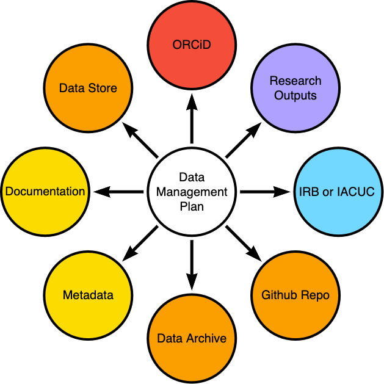

# Data Management

EcoHealth Alliance is committed to producing and promoting reliable and
reproducible research. In order to achieve this, we have to provide data
(and other research outputs) that non-team members can interpret and use; as well
as promote best practices for data management among collaborators. Ideally, the 
framework for managing data laid out in this chapter will facilitate the creation
of high quality, share-able research outputs. By focusing on [Data Management 
Plans](https://datamanagement.hms.harvard.edu/plan-design/data-management-plans) and the [dmptool](https://dmptool.org/plans), we can build on well 
established workflows for producing high quality research outputs.  

## Data Management Plan

*Data Management Plans* , also called *Outputs Management Plans* or *Data Management and Sharing Plans*, are living documents that help structure the creation and management of data throughout the lifecycle of a project. DMPs are flexible and do not force researchers to choose a particular technology set but rather ask probing questions about the mechanics and ethics of data use in research projects. Organizing data management in this way provides a common framework to think about data without requiring specific technologies be used in the research workflow. Furthermore, DMPs use stable identifiers (URIs) to connect  components of the research workflow, making long term data access more reliable.

The majority of funders require a DMP; however, each funder has specific expectations
about what, when, and how research outputs should be shared. It is important you 
and your collaborators understand those expectations before submitting a DMP. Its
equally important that all collaborators understand and agree to the obligations
created when submitting a DMP. Early communication between collaborators 
is key to navigating differing expectations about data sharing from researchers
in different contexts. 

*Data management plan as hub in knowledge management system*

**Important note on budgeting**:
Data management activities, but not necessarily infrastructure, are an allowable cost for most funding agencies (NIH, NSF, NASA). Gray areas include paying for hosting services and other infrastructure-like components of the DMP. 

**Benefits of using a DMP**:

1. They provide a scaffold for you to conceptualize data management for your project
    - What data do you need to answer your research question, where will it come from, what resources are needed throughout the project lifecycle, what are the mechanics of managing the data?
2. They make it easier collaborate
    - Defining responsibilities, Committing to using data standards, Documenting how the project works  
3. They make it easier for your data to be reused
    - You get more citations, your effort contributes to knowledge creation in unexpected ways, your results become more reproducible    
4. They are a funder requirement and you want funding
    - NIH, NSF, NASA, Wellcome Trust, etc. require a DMP be submitted with a proposal.   

**Components of a DMP**:

1. **Data Type** - What will be collected or created during the project?  
2. **Related Tools, Software, or Code** - Whats needed to make your analysis run?  
3. **Standards and Documentation** - How will people/machines know what they are looking at?  
4. **Where, when, and how will data be made accessible?**    
5. **Restrictions on data use** - How will you abide by ethical standards or other restrictions on data reuse?  
6. **Responsibilities** - Who is supposed to do what? How will you monitor that? What do they have to do it with?

**EHA DMP Philosophy**:

1. Its never too late to write a DMP  
2. Data Management Plans are living documents that change with a project  
3. DMPs are created collaboratively and stored in DMPTool.org  
4. We ensure our DMPs meet EHA best practices for [FAIR data](https://www.go-fair.org/fair-principles/) and Reproducible Science  
5. Projects should have adequate resources (personnel time, infrastructure, time in project schedule) to implement the DMP
6. Collaborators, especially those from outside institutions, are full participants in the DMP process 

### Expectations by project phase

**Proposal/Pre-Award Phase**

- Look for funder requirements and use funder specific templates for DMPs. If no template exists, use the EHA Minimal Data Management Plan or create one based on funder requirements.
- Think about how you might make data Findable, Accessible, Interoperable and Reproducible (FAIR)
    - use the [re3data](https://www.re3data.org/) data repository catalog to find identify a potential archive for your data 
- Establish expectations for data sharing and outputs with collaborators and PIs. These discussions should begin early at the same time as discussing project responsibilities and budget.
- Consider what tools you will use throughout the lifecycle of your data 
- Consider how data collection, analysis and management tasks will be divided among collaborators
- Incorporate data management activities into your project staffing, budget, and schedule
- Outline the ethical considerations for properly managing data in your project
- Ensure collaborators and PIs understand the commitments they are making via the DMP. Request and incorporate feedback from collaborators.
- `r params$data_librarian_appt` with the Data Librarian, create a timeline for proposal submission, and have a notion of tools and standards to use

**Post-Award/Early Phase**

- Review and update proposal DMP 
    - include updates from IRB or IACUC 
- Refine roles and tech stack
- Provide more detail on data collection and storage
    - Think about how measurements and primary data sets will be stored
    - Think about how statistical models and derived products will be produced and stored
    - Consider where data will be stored long term, how it will be accessed, and by whom
- Think about how you will store artifacts of analysis
    - Where will your code live? Who will be able to access it?  
    - If you're using spreadsheets with formulas, proprietary software or other methods analyzing data, how will you make that workflow reproducible?
- `r params$data_librarian_appt` with the `r params$data_librarian`

**Operational Phase**

- Link the plan to the research artifacts (data sets, publications, code repositories, etc.) being created via URI's.  
- Review, revise, and update components of the DMP
    - check that IRB/IACUC documents match DMP and protocols
- Make sure all SOPs and relevant data collection or analysis documents are accessible (linked) to the DMP 
- Check that data storage locations and methods are well described and linked 
- Check that necessary stakeholders are identified 
- Check that appropriate privacy and security measures are working as expected 
- Add any publications or research outputs are  to DMP outputs
    - DOI's can be assigned to code, datasets, and published articles
- Check that your data products and code meet the needs of your proposed long term storage solution
- `r params$data_librarian_appt` with the `r params$data_librarian`

**Publication and Archiving phase**

- Review and revise your DMP
- Check that linked objects are accessible to the appropriate individuals
- Add DOI or stable identifier for research objects 
    - DOI's can be assigned to code, datasets, and published articles
- Submit materials to long term storage
    - Ensure sharing and access are in agreement with requirements from IRB and/or research 
    - Use EHA institutional tags where possible e.g. [Zenodo Community](https://zenodo.org/communities/ecohealthalliance/?page=1&size=20)
- `r params$data_librarian_appt` with the `r params$data_librarian`

### Using DMPTool to create prepare your proposal data Management plan

0. [Create an account](https://dmptool.org/quick_start_guide) on DMPTool.org associated with EcoHealth Alliance
1. Identify Funder DMP requirements and `r params$data_librarian_appt` with the `r params$data_librarian`
2. Create a DMP using appropriate template given your funder. If no template is available or the funder has no requirements, use the EHA Minimal Data Management Plan. Add collaborators and complete as much of the plan as you can 
3. Principle Investigators and Project Partners explicitly agree to abide by the DMP. All collaborators should fully understand and agree with the data sharing components of the plan before approving it. 
3. Request feedback from the `r params$data_librarian`
4. Work with the `r params$data_librarian` to incorporate feedback 
5. Export DMP for inclusion in grant

## Notes on data management
*Can the data be shared and published, and easily re-used in other analyses*?

-   Create and maintain a [data management plan](https://dmptool.org/plans)
-   Store data in simple, interoperable formats such as CSV files.
-   Microsoft Excel can be a useful tool for data entry and organization, but
    limit its use to that, and organize your data in a way that can be easily
    exported.
-   Metadata! Metadata! Document your data.
-   For relational datasets you can create linked data on [Airtable](https://airtable.com/). For more information see \@ref(airtable)
-   For data sets that cross multiple projects, create data-only project folders
    for the master version. When these data sets are finalized, they can be
    deposited in public or private data repositories such as
    [figshare](https://figshare.com/) and [zenodo](https://zenodo.org/). In some
    cases it makes sense for us to create data-only R packages for easily
    distributing data internally and externally.

We aim to generally work in a **tidy data** framework. This approach to
structuring data makes interoperability between tools easier.

## Learn
-   Watch M3 on [Data Management Plans](https://airtable.com/appwlxIzmQx5njRtQ/tbledVCO9MRKkK9MW/viwfFq11zdwCbBT83/recNVSuG2ApgfYkbl?blocks=hide)
-   Read California Digital Library guidance on [Data Management Plans](https://dmptool.org/general_guidance)
-   [Data Management Plan Skill Building](https://dataoneorg.github.io/Education/bp_step/plan/) from DataOne
-   [NIH Data Sharing Guidance](https://sharing.nih.gov/data-management-and-sharing-policy)
  - [NIH Data Sharing learning Resources](https://sharing.nih.gov/about/learning)
  - [Condensed NIH DMSP Guidance Resources](https://osf.io/uadxr/)
-   [NSF Bio DMP Guidance](https://www.nsf.gov/bio/biodmp.jsp)
-   [EHA Repo with additional DMP Resources](https://github.com/ecohealthalliance/data-mgmt-plan)
-   Read Hadley Wickham's [tidy data
    paper](http://vita.had.co.nz/papers/tidy-data.pdf) for the general concept.
    Note the *packages* in this paper are out of date, but the structures and
    concepts apply.
-   [R For Data Science](http://r4ds.had.co.nz/tidy-data.html) is a great online
    book to read and reference for working in this framework, and gives guidance
    for the most up-to-date packages (**tidyr** being the latest analogue of
    **reshape** and **reshape2**).
-   Data Carpentry has [a Lesson on spreadsheet
    organization](http://www.datacarpentry.org/spreadsheet-ecology-lesson/) for
    when you need to do some work in Excel but make it compatible with R.
-   [Nine simple ways to make it easier to (re)use your
    data](http://ojs.library.queensu.ca/index.php/IEE/article/view/4608/4898)
    rounds some things out in terms of data sharing. [This
    post](https://dynamicecology.wordpress.com/2016/08/22/ten-commandments-for-good-data-management/)
    is nice, too.

## Install

Get the
[**tidyverse**](https://cran.r-project.org/web/packages/tidyverse/index.html)
package for R using `install.packages("tidyverse")`. This will install several
other relevant packages.
