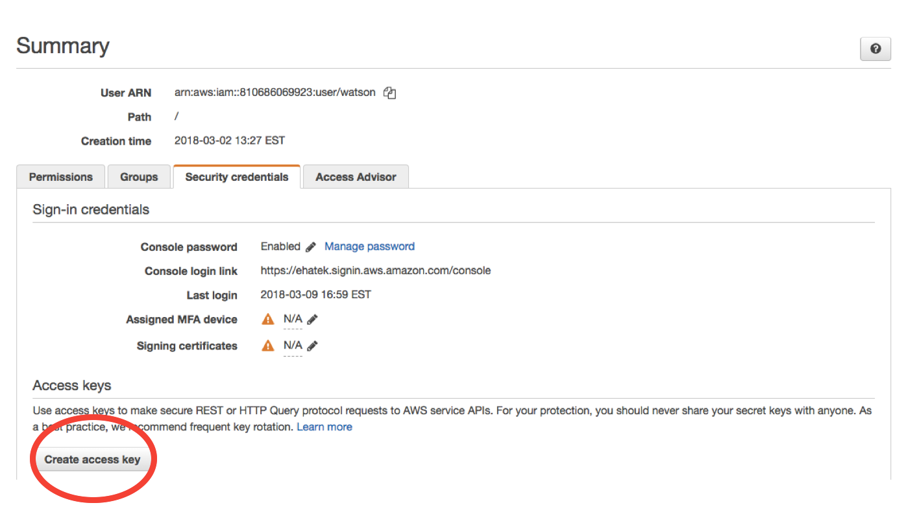

# Introduction {#introduction .unnumbered}

This handbook describes best practices and guidelines for project management,
organization, modeling and and programming we aim for our on the EHA Modeling &
Analytics team.

This is a living document. To make changes, just click the edit button
(<i class="fa fa-edit"></i>) at the top of the page. It will take you to the
source editor for the chapter on GitHub, where you can make edits and submit
your changes.

In general, we aim to produce sound analyses that are:

-   Self-contained
-   Well-documented and communicated
-   Easily reproducible
-   Sharable
-   Version controlled

Together, these attributes help assure that our work is correct, can be built
off of and extended, meets requirements for sharing and publication, and can be
continued through staff turnover.

The tools we use to accomplish this are mostly, but not exclusively, based
around the R programming language and git version control. Other teams at EHA
use other tools (e.g., the technology team mostly uses Python and Javascript,
much of our work with partners is MS Office based).

The guidelines in the document represent an ideal we aim for but to not always
attain. Remember:

-   Best practices are always evolving.
-   Don't let the perfect be the enemy of the good.
-   Other teams and external partners have different workflows and we adjust as
    neccessary to collaborate.
-   Our goal is to do good science to advance conservation and human health, not
    be slick programmers.

You can find some slides from a previous presentation on this topic
[here](assets/selfish-reproducibility-NR-2016-01-26.pdf).

The philosophy and guidelines in this document owe an enormous amount to the
work of the [Software and Data Carpentry](http://software-carpentry.org/) and
[rOpenSci](http://ropensci.org/) organizations, and the work of [Hadley
Wickham](http://hadley.nz/) and [Jenny Bryan](http://www.stat.ubc.ca/~jenny/).
You'll find many links to their work in this handbook.

<!--chapter:end:index.Rmd-->

# Quickstart for computing

In addition to the standard computer setup provided by office admin (Email, MS
Office, etc), M&A members should do the following:

-   Download and install [Slack](https://slack.com/downloads/osx). If you don't
    alread have an invite, get one from Noam. Join the **\#data-sci-discuss**
    and **\#journal-club** channels any others your
    supervisor suggests or are associated with projects you are assigned to.
    (Don't forget **\#random** and **\#out-of-office-fun**!)
-   If you don't already have one, sign up for an account on
    [GitHub](https://github.com/). Provide Noam with your username so as to add
    you to the EcoHealth Alliance team. If you already have a GitHub account
    using a personal email, [add your EHA email to your
    account](https://github.com/settings/emails) and [set up custom routing to
    direct EHA organization notifications to your EHA
    email](https://github.com/settings/notifications)
-   Install R and then RStudio. Links and instructions can be found
    [here](http://stat545.com/block000_r-rstudio-install.html)
-   Install git and link it to RStudio and your GitHub account. Instructions for
    all of this are found [here, in Sections 7-15 of *Happy Git with
    R*](http://happygitwithr.com/install-git.html). If you get stuck along the
    way don't hesitate to ask for help (via the **\#data-sci-discuss** channel on
    Slack!).
-   Install Dropbox on your computer with your EHA account (note you can have
    separate personal and EHA Dropbox folders)
-   Check that your EHA email gives you access to Google Drive. If you prefer
    it, or your supervisor specifies it, [install it locally on your
    computer](https://tools.google.com/dlpage/drive)

## Optional

In addition, the following programs may be helpful to install (all for Mac
users):

-   [Homebrew](https://brew.sh/) for general package management
-   [iTerm2](https://www.iterm2.com/) for a better shell interface.
    (`brew cask install iterm2` using Homebrew in the shell)
-   [mosh](https://mosh.org/) for connecting to our high-performance servers
    (`brew install mosh` using Homebrew in the shell)
-   [hub](https://hub.github.com/) for interacting with GitHub from the shell (`brew install hub`)

<!--chapter:end:quickstart.Rmd-->

# Project Management {#projects}

## Teams and Work Cycles

At EHA *projects* are typically months-to-years-long workstreams centered around
a main analytical or research problem. A program, grant or contract may have
multiple projects, and a project may have multiple outputs such as reports,
scientific publications, or apps. A project typically has a small (2-5 person
team) with a project lead and possibly a project administrative point of contact
(APOC).

We organize projects into *work cycles* of 4-8 weeks. For each cycle, a team
should define day-to-week scale tasks, assign tasks to members, determine the
percentage of time team members will put towards the project in that cycle,
given other workloads, and plan travel, reporting, collaboration, or other
deadlines.

Teams report out their progress at the end (and start) of each work cycle at our
weekly M&A meetings. Report-outs should include

-   Progress on tasks assigned and completed in previous cycle
-   Substantive report-out of results and products
-   Draft plan for tasks and goals for the coming cycle
-   Team assignments for the next cycle and level of involvement (high
    (&gt;50%), medium (25%-50%, low (&lt;25%)) of team memberss over the cycle.
-   Any additional deadlines or reporting anticipated in that time frame,
    including plans for other internal presentations or feedback sessions.

During report-outs, the M&A group will provide feedback for the upcoming cycle
and set a date for the next one.

Teams track work cycle progress through various mechanisms based on team
preferences. One option is GitHub Milestones
([Example](https://github.com/ecohealthalliance/asl2050-ai/milestones)). Others
use Google Spreadsheets, [Asana](https://asana.com/), or other systems. Teams
may choose what they prefer as long as their system

-   Shows current tasks, deadlines, and assignments Tracks past tasks,
    deadlines, and assignments
-   Includes top-level summaries for a reporting period
-   Is available in "real time" online rather than stored on individual machines
    and e-mailed
-   Can be made accessible to other staff via a URL but kept private within EHA

## Setup and materials Organization

An M&A project lasting more than one work cycle should typically have a Slack
channel for communication, a GitHub repo for data and analysis code, or Dropbox
or Google Drive folder for documents or materials not appropriate for git-based
version control. In addition, it may have a Paperpile folder for references. In
general, one URL (often the GitHub README) should be the starting point from
which one can reach all project materials.

### Code organization

In general, one should aim to set up the analysis portion of a project in a
self-contained way, with clear separation between raw data, processed data,
exploratory analyses, and final products. In organizing a project folder, ask

-   *If I copied this whole folder onto someone else's computer, could they pick
    up the project?*
-   *Are the folder organization and file naming clear?*

-   There are some exceptions for large data sets or rapidly changing data sets.
    In these cases, data can be organized as a separate folder or project, and
    large data sets can be store in an Amazon Web Services S3 bucket.

-   In many cases it is actually best for data to be organized as a *separate
    repository* from analysis. This allows multiple analysis projects to rely on
    the same upstream data project, avoiding multiple versions of data. In these
    cases the "data" project should include raw data, aggregation and cleaning,
    and its output will be cleaned but complete (not summarized data). Analysis
    projects can import this data as a first step.

#### Resources

-   Here is [a nice blog post about project
    structure](http://nicercode.github.io/blog/2013-05-17-organising-my-project/)
-   and a few more
    [alternatives](https://discuss.ropensci.org/t/resources-on-project-directory-organization/340).
-   For anything using R, [RStudio
    projects](https://support.rstudio.com/hc/en-us/articles/200526207-Using-Projects)
-   are a good idea for project organization. Here's a [Software Carpentry
    Lesson on RStudio
    projects](http://swcarpentry.github.io/r-novice-gapminder/02-project-intro/).


<!--chapter:end:projects.Rmd-->

# R and Reproducible Analysis {#r}

*Can everything be re-done easily if I change one data point in the inputs?*

At EHA **R** is our primary, though not exclusive, tool for analysis and
modeling work. R is not just a piece of software for statistics and data
manipulation but a computer language, meaning that our analyses are *scripted*.  This means they
thus can be automated, run again, built upon and extended.

## Install

-   [R itself](https://cran.r-project.org/)
-   [RStudio](https://www.rstudio.com/), the leading R development environment.

## Learn

Learning R is beyond the scope of this document, and you likely already have
some experience in it, but some good starting points are:

-   [The Software Carpentry Lessons](http://swcarpentry.github.io/r-novice-gapminder/)
-   [Swirl](http://swirlstats.com/), a set of interactive lessons run right
    in R.
-   [The JHU Coursera Series](https://www.coursera.org/specializations/jhu-data-science)
-   [R for Data Science by Hadley Wickam](http://r4ds.had.co.nz/) is a
    beginner/intermediate text that we highly recommend for getting up to speed
    with the particular workflows we recommend and the most recent packages that
    support them.
-   [Advanced R (Wickham)](http://adv-r.had.co.nz/) is very good for
    understanding how the language works.
-   [Efficient R by Colin Gillespie and Robin
    Lovelace](https://csgillespie.github.io/efficientR/) is helpful for
    imporving workflows and speeding up code.
-   [R Packages (Wickham)](http://r-pkgs.had.co.nz/) is good for package
    development.
-   [Cheatsheets](https://www.rstudio.com/resources/cheatsheets/) from RStudio
    are a useful references for a number of things.

[DataCamp courses](https://www.datacamp.com/onboarding/learn?from=home&technology=r) are also potentially useful.
If you feel they would match your learning style and needs, discuss EHA purchasing a subscription for you with your supervisor.

These resources are largely about the mechanics of programming in R, rather
than using it for statistical analyses.  This is a far larger subject, but see
the [Statistical Methods] section for a jumping-off point.  

<!--chapter:end:r.Rmd-->

# Communication

*How do we work together and keep a useful record of our interactions?*

-   [Slack](https://eha.slack.com/) is our office chat tool and is good for
    day-to-day communication. Slack does not have to be an instant communication
    tool - some people prefer to check it a few times a day. Check with your
    supervisor about your project/team preferences. Slack's main purpose is to
    organize our communication by *channels* specific to a topic or project. It
    is good for keeping information from one project together in a way that can
    be referenced later by new team members, rather than being lost in various
    e-mail inboxes. A channel can be linked to many other tools (Dropbox/Google
    Drive Folder, GitHub Repository), so as to have a central hub for project
    management. E-mails can be forwarded to a channel.

    Slack also has voice-calling and, critically, screen-sharing capabilities
    that are useful for pair-debugging while programming.

-   GitHub ([see below](#version-control-and-collaboration)) has a good
    issue-tracking system that accompanies each project and can be used for task
    management and general communication. This ties messages to a specific
    project and keeps a good long-term record, and can be connected to a slack
    channel or integrated with e-mail
-   Remember that your Slack and GitHub communications are part of your project
    and are likely to be seen by both internal and external collaborators.

## Install

-   Download and install [Slack](https://slack.com/downloads/osx). If you don't
    alread have an invite, get one from Noam. Join the **\#data-sci-discuss**
    and **\#journal-club** channels and any others your
    supervisor suggests or are associated with projects you are assigned to.
-   There's also a mobile Slack app for
    [iOS](https://itunes.apple.com/us/app/slack-team-communication/id618783545?mt=8)
    and
    [Android](https://play.google.com/store/apps/details?id=com.Slack&hl=en),
    which may be helpful if you are traveling.

<!--chapter:end:communication.Rmd-->

# Documentation and Outputs

*Will someone understand this thing when I hand it over?*

Documentation is essential to collaboration and continuity for our work. Your
project should contain documentation to allow a project to be picked up by
another user. Documentation includes the following:

-   A **README** document in the top level of the project folder with a
    high-level explanation of project organization, purpose, and and contact
    info.
-   **Metadata** for your data set showing its origin and the type of data in
    each field in a table.
-   **Comments** in your computer code
-   **Written descriptions** of your analyses. The primary medium for this
    should be **R Markdown** documents, which allow you to combine code,
    results, and descriptive text in an easy to update and modify form. Shorter
    ephermal results can be posted as plots to your project Slack rooms.

## Learn

-   R Markdown is pretty straightforward to learn. You can create your first
    document and get the basics by going to File &gt; New File &gt; R Markdown
    in the RStudio menu. When you have time, dive in a bit more with [this great
    lesson on it](http://rpubs.com/marschmi/RMarkdown) with accompanying
    [video](https://www.youtube.com/watch?v=WFAHJ0NHOEQ&feature=youtu.be).
    Here's an [RStudio Reference
    Sheet](https://www.rstudio.com/wp-content/uploads/2015/03/rmarkdown-reference.pdf)
    for R Markdown.

## Install

-   (Very optional unless you are asked):
    [**ehastyle**](https://github.com/ecohealthalliance/ehastyle) is our
    internal EHA R package with R Markdown templates for some reports we
    produce.
    
## Library 

Once your project has been published, you should include the output in our EHA Library. Simply submit through [this google form](https://goo.gl/forms/pnJr4SGvlY8gyi2I3). The library database, along with full texts of both media and science publications, is stored on [DropBox](https://www.dropbox.com/sh/cdt1tvxddogw90m/AACH3HT9L5WDbpf2K_sOpy6Ta?dl=0). The purpose of the EHA Library is to store our work in a searchable, systematic database. A centralized location of EHA work is of use to our science and development teams. Additionaly, standardized analyses (stored in the [eha-library github repository](https://github.com/ecohealthalliance/eha-library)) create easy reporting to our board, our funding bodies, and the public. We have found this database particularly useful in the on-boarding of new staff. 

The current scope of the Library includes:

-   Scientific publications
-   Conference presentations
-   Layman publications by EHA staff 
-   EHA-mentored academic work
-   Media articles that highlight our work or our scientists

<!--chapter:end:documentation.Rmd-->

# Data Management

*Can the data be shared and published, and easily re-used in other analyses*?

-   Store data in simple, cross-compatible formats such as CSV files.
-   Microsoft Excel can be a useful tool for data entry and organization, but
    limit its use to that, and organize your data in a way that can be easily
    exported.
-   Metadata! Metadata! Document your data.
-   For relational datasets you can create linked data on [Airtable](https://airtable.com/)
-   For data sets that cross multiple projects, create data-only project folders
    for the master version. When these data sets are finalized, they can be
    deposited in public or private data repositories such as
    [figshare](https://figshare.com/) and [zenodo](https://zenodo.org/). In some
    cases it makes sense for us to create data-only R packages for easily
    distributing data internally and externally.

We aim to generally work in a **tidy data** framework. This approach to
structuring data makes iteroperability between tools easier.

## Learn

-   Read Hadley Wickham's [tidy data
    paper](http://vita.had.co.nz/papers/tidy-data.pdf) for the general concept.
    Note the *packages* in this paper are out of date, but the structures and
    concepts apply.
-   [R For Data Science](http://r4ds.had.co.nz/tidy-data.html) is a great online
    book to read and reference for working in this framework, and gives guidance
    for the most up-to-date packages (**tidyr** being the latest analogue of
    **reshape** and **reshape2**).
-   Data Carpentry has [a Lesson on spreadsheet
    organization](http://www.datacarpentry.org/spreadsheet-ecology-lesson/) for
    when you need to do some work in Excel but make it compatible with R.
-   [Nine simple ways to make it easier to (re)use your
    data](http://ojs.library.queensu.ca/index.php/IEE/article/view/4608/4898)
    rounds some things out in terms of data sharing. [This
    post](https://dynamicecology.wordpress.com/2016/08/22/ten-commandments-for-good-data-management/)
    is nice, too.

## Install

Get the
[**tidyverse**](https://cran.r-project.org/web/packages/tidyverse/index.html)
package for R using `install.packages("tidyverse")`. This will install several
other relevant packages.

<!--chapter:end:data.Rmd-->

# Version Control, Git and Github

-   *Can I go back to before I made that mistake?*
-   *Can others see changes others have made to the project and can I see
    theirs?*

**Version control** is essential to long-term project management and
collaboration. We primarily use git for this - we recommend it for any project
with more than one file of code. It has a steep learning curve but is very
powerful.

-   [GitHub](http://github.com) is a web service for sharing git-versioned
    projects that has many great tools for collaboration. We have an
    organizational GitHub account so we can have private repositories and work
    in teams with shared projects.

-   For projects with little code-based work, there are other options, as well:
    -   Google Docs/Word Track Changes are limited to *single documents*
    -   Dropbox can track all files in a shared project/folder
        -   Allows one to view/revert to any previous version of a file in the
            folder
        -   Easily sharable
        -   Does not travel well - history is lost when project moves elsewhere
        -   File histories are independent - does not track interrelated
            changes.
-   Avoid filename-based version control:

    

## Learn

Git has a steep learning curve and we recommend you spend some time learning
rather than only trying to pick it up as you go along.

-   Here is a good video course
    ([Part1](https://www.youtube.com/watch?v=IpUDlhh8I2E) /
    [Part2](https://www.youtube.com/watch?v=S8TLL05qVFg)), based on the
    [Software Carpentry curriculum](http://software-carpentry.org/lessons/).
    (Links to the syllabus are in the notes below the videos.)
-   [Happy Git with R](http://happygitwithr.com/) is a great reference for the
    nuts and bolts of connecting your git, GitHub and R workflows
-   Here is a useful git [cheat sheet](https://www.git-tower.com/blog/git-cheat-sheet/)

## Install

-   Go through the installation steps [Happy Git with
    R](http://happygitwithr.com/)'s "Installation" and "Connect" chapters and
    Appendix B
-   Note when setting up your GitHub account that one account can have multiple
    e-mail addresses associated with it, so you can split your work and personal
    stuff without needing multiple accounts (see
    [here](https://help.github.com/articles/managing-notification-emails-for-organizations/)).
-   Give [Noam](ross@ecohealthalliance.org) (Modeling & Analytics) or
    [Toph](allen@ecohealthalliance.org) (Tech), your GitHub username so they can
    make you a member of the [organizational EHA
    account](https://github.com/ecohealthalliance) and be given access to the
    appropriate teams.
-   If you are using a GitHub account you previously created with another
    e-mail, be sure to add your EHA e-mail under [Email
    Settings](https://github.com/settings/notifications) and set "Custom
    Routing" under [your notification
    settings](https://github.com/settings/notifications) so that notifications
    related to the EHA organization go to your EHA e-mail.
-   Install Dropbox on your computer with your EHA account (note you can have
    separate personal and EHA Dropbox folders)
-   Check that your EHA email gives you access to Google Drive. If you prefer
    it, or your supervisor specifies it, [install it locally on your
    computer](https://tools.google.com/dlpage/drive)

<!--chapter:end:versioning.Rmd-->

# Reviewing Analyses and Code

-   *Has my work recieved feedback? Has a second set of eyes checked it for
    correctness?*
-   *Have I learned from my colleagues' work?*

Just like any piece of writing that you do, your analysis code should be
reviewed by a peer or supervisor. There are generally two types of code reviews
we engage in:

-   **Unit reviews** are reviews of discrete, small parts of a project. This
    might be an analysis that you took a few days or a couple of weeks to
    complete, and consists of 1-2 files or a few dozen to hundred lines of code.
    When you complete such a discrete unit, you should solicit feedback.
-   **Project reviews** are reviews of a whole project as it wraps up, such as
    prior to the submission of a manuscript. These reviews aim to check that the
    project is complete, understandable and reproducible.

Reviews can be either

-   **In person reviews** where you go over your code with your team or at our
    informal science meetings. ScreenHero can also be used for this.
-   **Written reviews** where a peers place comments in your code or use the
    commenting and reviewing features on GitHub.

or both.

## Learn

-   Check out Fernando Perez's [tips for code review in the
    lab](http://fperez.org/py4science/code_reviews.html).
-   Read the [Mozilla Guide to Code Review in the
    Lab](https://mozillascience.github.io/codeReview/intro.html)
-   Check out some [rOpenSci package review
    examples](https://github.com/ropensci/onboarding/issues?q=is%3Aissue+is%3Aclosed)
    to look at one kind of code review in action.
-   Best practices for this are evolving. Check out [a recent conversation among
    scientists on Twitter on the
    topic](https://twitter.com/noamross/status/776087608468307970)


<!--chapter:end:review.Rmd-->

# Testing

*Is this code doing what I think its doing? Is this data correct?*

Most code should be accompanied by some form of testing. This scales with the
size and type of project. Your work should generally accompanied with testing
code or outputs that show that your models behave appropriately, are
statisically sound, that your code is running as you expect and your data is
checked for quality.

## Learn

-   [Test driven data
    analysis](http://www.tdda.info/pages/table-of-contents.html#table-of-contents)
    is a neat blog on this subject.
-   There's a [testing chapter in the R Packages
    book](http://r-pkgs.had.co.nz/tests.html).
-   The vingettes and README files of the packages below are useful.

## Install

-   R packages: [**assertr**](https://github.com/ropenscilabs/assertr/) or
    [**validate**](http://www.markvanderloo.eu/yaRb/2016/03/25/easy-data-validation-with-the-validate-package/)
    for testing that data meets criteria
    [**visdat**](https://github.com/njtierney/visdat) for visually inspecting
    tabular data. (though there are many ways to plot your data for inspection).
    [**testthat**]() for functions and R packages.


<!--chapter:end:testing.Rmd-->


# High-Performance Servers

*How can I make this giant beast of a model run faster?*

-   Our Aegypti server has 40 cores and 250G of RAM, and can be accessed from
    anywhere, and has and easy-to-use RStudio interface. It's a good go-to for
    most biggish analyses you might do.
-   The server is generally most useful if you can parallelize your R code
    across many processors . It's also useful if you have jobs that need a large
    amount of memory (often big geospatial analyses), or just something that
    needs to run all weekend while your computer does other things.
-   We have an \#eha-servers Slack room, for coordinating use of this and other
    servers. Check in there if you have questions or before running a big job.
-   There is no privacy on Aegypti - system admins can, and do, go into everyone's
    file systems for maintenance purposes.
-   We also have accounts for Amazon Web Services for appropriate projects.

<div style="width: 100%; text-align: center;">

<div data-netdata="system.cpu" data-dimensions="user"
data-chart-library="easypiechart" data-easypiechart-max-value="100"
data-units="%" data-width="150px" data-after="-60" data-points="60"
data-title="CPU Usage" data-units="%" data-colors="#FF5555">

</div>

<div data-netdata="system.ram" data-dimensions="used|buffers|active|wired"
data-append-options="percentage" data-chart-library="easypiechart"
data-title="RAM Usage" data-units="%" data-easypiechart-max-value="100"
data-width="150px" data-after="-60" data-points="60" data-colors="#66AA00">

</div>

<div data-netdata="disk_space._" data-title="Hard Disk Usage"
data-append-options="percentage" data-decimal-digits="0" data-dimensions="used"
data-chart-library="easypiechart" data-width="150px" data-after="-60"
data-points="60" data-easypiechart-max-value="100" data-units="%">

</div>

<script type="text/javascript" src="https://aegypti.ecohealthalliance.org:22051/status/dashboard.js"></script>

</div>

## Install

-   Contact [Noam](mailto:ross@ecohealthalliance.org) for access to this machine
    and he will create an account and password for you and give you further
    instructions.
-   Log on to the RStudio server interface by pointing your browser at
    http://aegypti.ecohealthalliance.org:8787/. For SSH-based access just use
    `ssh aegypti.ecohealthalliance.org` from the terminal.  You can also access
    the terminal via under the "Tools" menu in the RStudio interface.
-   You will use GitHub to move project work back and forth from your local
    machine. You will need to setup GitHub access from this machine using SSH
    keys as described in [Happy Git with R Chapter
    12](http://happygitwithr.com/ssh-keys.html). You'll also have to set up your
    tokens [Appendix B](http://happygitwithr.com/github-pat.html) again.
-   We run different "versions" of Aegypti as virtual Docker machines on different
    ports.  Your files are shared across these, but sometimes they have different
    versions of R or other programs available.  

## Learn

-   [Chapter 7.4 of *Efficient
    R*](https://csgillespie.github.io/efficientR/performance.html#performance-parallel)
    provides a brief introduction to parallelization.
-   Not everything can be done from the RStudio server interface on the server.
    If you are not familiar with the shell interface, brush up via [this
    Software Carpentry lesson](http://swcarpentry.github.io/shell-novice/).  Here's a useful
    [cheat sheet](https://www.git-tower.com/blog/command-line-cheat-sheet/) on the topic.
-   Look
    at this [chapter](http://v4.software-carpentry.org/shell/ssh.html) from an
    old version of the lesson for instructions on using the Secure Shell (SSH)
    to login to the server remotely and setting up keys so you don't have to
    enter your password every time.
-   Other helpful things you might look into are [tmux](https://tmux.github.io/)
    for keeping shell processes running when you log off (already installed),
    and [SSH config
    files](http://nerderati.com/2011/03/17/simplify-your-life-with-an-ssh-config-file/)
    for simplifying shell logon.

## Being a good neighbor

- Aegypti is a shared EHA resource, so good communication and responsible use are paramount to keeping it up and running smoothly for all of us. As mentioned before, we have an \#eha-servers Slack room, for coordinating use of our servers. Check in there if you have questions or before running a big job.

### Hard Disk Space Limits
- We have a lot of RAM (256GB!), but in general, we need at least as much free disk space as RAM, since RStudio keeps temporary copies of your R session on-disk in case of a crash. We have a relatively small disk (1 TB), because it is a very high performance SSD.
    - It is very easy to generate LOTS of temporary data so take that into consideration. This is especially true for spatial analyses using raster files. The default settings on aegypti have been configured to delete these raster temp files quickly, but keep this in mind if you are performing spatial analyses and are running out of hard disk space -- raster temp files may be the culprit.
    - Aegypti is for temporary, in-progress projects, not long-term storage:
        - Keep project code on Github.
        - Use a shared directory, `storr`, GRASS GIS for big shared data sets.
        - Unused files need to be downloaded and stored locally, on our NAS backup, or on Amazon S3 buckets (see below)
    - There are several memory-related points to keep in mind when using RStudio on Aegypti:
        - `.Rdata` files can take up a lot of space. You can explicitly save important objects you create individually with `saveRDS(object, "filename")` and load them with `objects <- readRDS("filename")`.
        - `.Rproj.user` directories in each of your R projects hold large clones of your sessions. They might be orphaned after a session crash -- these files can be safely deleted.
        - In general, your RStudio options should NOT save your environment. 
- To explore your Aegypti directories and manage your large files, you can use `ncdu` from the terminal.

### Managing RAM Usage
- Aegypti has a lot of RAM (256GB), but with several projects running at once, we sometimes reach this upper limit. When we do hit the upper limit, the next process that requests memory over that limit will likely be the process that gets terminated. This means that if you run a very large job and are not aware of current memory usage, you may accidentally trigger the termination of someone else's process -- a process that might have been running for hours, days, or weeks!
- For this reason, it's good to know how much RAM is currently in use, and how much you think you will be using:
    - To check on the current state of Aegypti, use `htop` by typing `htop` into an aegypti-connected terminal window. This program graphically shows the status of all 40 cores, along with the amount of RAM in use and all the processes currently being run.
- When thinking about how much RAM you might need, remember that many implementations of paralellized code will make copies of the objects being manipulated to send to each core. This potentially multiplies your RAM usage by the number of cores you run on: if you were only using 8GB, but parallelize to 20 cores, you could end up taking up 160GB of space! Before running a large job over many cores, it makes sense to take a look at its memory footprint on just one core. As always, if you need advice
- Your RStudio environment can take up considerable RAM, so please clear it when not in use. Exiting the browser window from an RStudio session will not immediately quit your session, and you will still be holding on to memory from the objects in your environment. To explicitly exit your RStudio session in a browser, go to `File -> Quit Session` in the menu bar. This will quit your session and free up RAM space for other users. 


## Cloud computing with Amazon Web Services

-  EHA has an organizational Amazon Web Services account that may be useful for some
   projects.  AWS S3 storage is useful for hosting large data files.  AWS EC2 cloud
   computers may be appropriate for a hosting a web app or database, automating regular processes,
   or other analytical projects.
-  Contact Noam for access to the AWS account, to discuss whether AWS will be
   useful for your project, or to discuss other cloud resources.
-  All resources used on AWS need to be tagged with a `project:PROJECTNAME` tag
   in order to assign costs to the appropriate EHA projects.
-  Be judicious with AWS service usage.  It is easy to run up costs.


<!--chapter:end:hpc.Rmd-->

# Cloud Computing Services

- _What if my data files are too big to hold in Github?_
- _Where is the latest IUCN/MODIS/LANDSAT shapefile?_
- _What if I need more CPUs than even Aegypti has?_


EHA has an organizational Amazon Web Services account that may be useful for some projects. **AWS S3 storage** is useful for hosting large data files, especially if they are shared across projects. **AWS EC2 cloud computers** may be appropriate for a hosting a web app or database, automating regular processes, or other analytical projects.

If you think you need cloud resources for your project, contact Noam or Toph for access to the AWS account, to discuss what services or other providers may be useful.

If you are using AWS, remember:

- All resources used on AWS need to be tagged with a project:PROJECTNAME tag in order to assign costs to the appropriate EHA projects.
- Be judicious with AWS service usage. It is easy to run up costs.

## Setting up Amazon Credentials 

To connect to AWS via program like R, you will net to set up an access access credientials.

Once you've gotten your credentials, log on to [ehatek.signin.aws.amazon.com/console/](ehatek.signin.aws.amazon.com/console/). `ehatek` should be already entered in the "Account ID or alias" field. You will be asked to change your password after the first time you log on.

### Generate an access key

Navigate to your IAM (Identity and Access Management) page to generate an access key.


You should see a `r emo::ji("white_check_mark")` next to "rotate your access keys." Click "Manage User Access Keys" after expanding the access key subheading.  (If you see an `r emo::ji("x")`, ask whoever created your account if you have the appropriate S3 privileges.) 


Click the "Security credentials" panel and scroll down to the "create access key" button. 

 

Your access key will have a `key ID` - a long string of letters and numbers - and a `*~*secret*~* access key` - a longer string of letters and numbers. Press "show" and hang onto it somewhere until you are sure your `~/.aws/credentials` file is working as intended. **Don't share your secret key with anyone**. 

If you lose it before you use it, you can delete your and make another one. *Deleting* a key is different from making a key *inactive* - you might reach your access key limit pretty quickly, so you'll probably have to do the former if you have keys that you don't use. 

### Create a credentials file 

Open a blank text file in a text editor and paste your key ID and secret key as follows. It will look like this:

```
[default]
aws_access_key_id = your_key_id
aws_secret_access_key = your_secret_access_key
aws_default_region = us-east-1"
```

Replace `your_key_id` and `your_secret_access_key` with the values you see in the AWS browser.

Create a folder called `~/.aws`, and put the `credentials` file in it. 

(**YES**, currently, you need that trailing `"` after `us-east-1` if you want to include the AWS_DEFAULT_REGION in your credentials file, because the `aws.signature` is using a strange parser.) If you get errors related to the AWS default region, you can delete that line and set it locally inside your R environment like this:

```{r, eval = FALSE}
Sys.setenv("AWS_DEFAULT_REGION" = "us-east-1")
```

### Test your Key 

Open an R session to make sure your credentials file works. 

```{r, eval = FALSE}
# install the AWS packages if you need them
if (!require(aws.s3)) devtools::install_github("cloudyr/aws.s3")
if (!require(aws.signature)) devtools::install_github("cloudyr/aws.signature")

library(aws.s3)

# load credentials from your credentials file 
aws.signature::use_credentials()

# check list of aws S3 buckets 
head(aws.s3::bucketlist())
```

If you get a '403 Forbidden' error, your credentials aren't working. 

### Alternate credentialing method 

If you have Done Your Googles and are still having trouble setting your AWS credentials, you can set them in your `.Renviron` file. The advantage of using an `~/.aws/credentials` file is that your key will then work across all platforms - R, Python, the command line, etc. However, if you're only connecting to AWS through R, having your key in your `.Renviron` will be enough.


```{r, eval = FALSE}
# If you don't know how to find your .Renviron file, do the following to open it:  
if(!require(usethis)) install.packages("usethis")
usethis::edit_r_environ()

# add the following to your .Renviron, replacing your_key_id and your_secret_access_key with their actual values. Save your .Renviron and restart R.
"AWS_ACCESS_KEY_ID" = your_key_id
"AWS_SECRET_ACCESS_KEY" = your_secret_access_key
"AWS_DEFAULT_REGION" = us-east-1
```

After you restart R, test that your credentials are working with `aws.s3::bucketlist()`. 

## Using Amazon S3 Storage from R

Above, you used `bucketlist` above to list all the buckets associated with your account. To look at everything inside a specific bucket, use `get_bucket`.

Note that Amazon **charges per Gigabyte for downloading and uploading files.** Use things as needed for your project, but don't get crazy and put a file download inside a for loop that you're running a thousand times a day.

To test privacy privileges are working are intended, we'll use a very small private bucket with ~4 KB in it - Two small subsets of the Social Security Administration's baby names dataset from the `babynames` package.

```{r, eval = FALSE}
# check list of aws S3 buckets 
bucketlist()

# aws.s3::bucketlist()
pb <- "eha-ma-practice-bucket"
b <- get_bucket(pb)

```

### Save objects from S3 to your machine

One of the main reasons we use Amazon S3 is to make sure everyone is working with the same large data files. Usually, you'll download the large files you need one time and keep them on your local machine for analyses. This can be done with `save_object`. Wrapping `save_object` in an `if()` clause checks to see if the dataset exists first before downloading. 

```{r, eval=FALSE}
# make a data folder if this is the first dataset you're downloading into this project
if(!dir.exists("data")) { 
  dir.create("data")
}

# save the babynames_subset.csv object (b[[1]]) into local memory
if(!file.exists("data/babynames_subset.csv")) {
  save_object(object = b[[1]], bucket = pb, file = "data/babynames_subset.csv")
}

dir("data")
```

`babynames_subset.csv` is now in your `data` directory.You can then read it into memory as you would normally.  

### Upload objects from your machine to S3

To `put` a file from your computer back into the bucket, use `put_object`. This will be less common than downloading and saving objects *from* S3 - as a general rule, we want everyone working with the same versions of large datasets.  If you've made a large rasterfile that your colleagues will use, you can upload it,

In this example, we'll make a change to the `babynames_subset` and save it as a new file (`babynames_subset2`).  

```{r, eval = FALSE}
babynames_subset2 <- babynames_subset %>% 
    group_by(name) %>% 
    summarize(n = sum(n)) %>% 
    filter(n < 100) 

# save to csv 
write.csv(babynames_subset2, file = "data/babynames_subset2.csv", row.names = FALSE)

# check whether an object with this name is in the bucket, and if it isn't, put it in there
if(!("babynames_subset2.csv" %in% dplyr::pull(get_bucket_df(pb), "Key") ) {
  put_object(file = "data/babynames_subset2.csv", object = "babynames_subset2.csv", bucket = pb, acl = "private") 
}

```

So now we have a data frame in memory called `babynames_subset2` and a .csv in the AWS `eha-ma-practice-bucket` called `babynames_subset2.csv`. We'll pull the AWS csv back into memory to make sure they're the same. 

To do this, we have to first copy over `babynames_subset2` to a new object in memory and remove it so that when we load the version from AWS, it doesn't overwrite it. 

```{r, eval = FALSE}
babynames_subset_R <- babynames_subset2 
rm(babynames_subset2)

# save the .csv object using "save_object"
tmp = tempdir()
file = paste0(tmp, "/babynames_subset2.csv")
save_object("babynames_subset2.csv", bucket = pb, file = file)

# read the csv file into memory 
babynames_subset2 <- read_csv(file)
```

Finally, we can check that the object in memory and the .csv in AWS are the same. 

```{r, eval = FALSE}
assertthat::are_equal(babynames_subset_R, babynames_subset2)
```

<!--chapter:end:cloud-services.Rmd-->

# Dependency Management {#dependencies}

*How do I make sure that all my software and configurations needed for a project
are portable?*

-   [Packrat](https://rstudio.github.io/packrat/) or
    [checkpoint](https://CRAN.R-project.org/package=checkpoint) to fix R package
    versions.
-   [Docker](https://www.docker.com/) for everything
    -   [A lesson in user Docker for an R
        project](http://ropenscilabs.github.io/r-docker-tutorial/)
-   Makefiles can automate a complex, multipart project. Here's [a lesson on
    them from Software Carpentry](http://swcarpentry.github.io/make-novice/)

-   R packages can be a useful project output. We have some in-house R packages
    to provide access to internal data and generate reports, and may be
    developing more for external audiences. Hadley Wickham's [R Packages
    Book](http://r-pkgs.had.co.nz/) provides guidance for these, and we expect
    our packages to be up to [rOpenSci
    standards](https://github.com/ropensci/onboarding).


<!--chapter:end:dependencies.Rmd-->

# Statistical Methods

Statistical methods are a far larger subject than can be covered in this
handbook. Our team uses a wide variety of methods that differ by project and
change via advances in the field. Nonetheless, here are some methods that we
favor when they are appropriate.

## Multivariate Regression

-   We like Generalized Linear Models. Many of us approach these from a Bayesian
    perspective, and build and fit these models using
    [Stan](http://mc-stan.org/). A great introduction to this type of modeling
    is found in [Statistical
    Rethinking](http://xcelab.net/rm/statistical-rethinking/), by Richard
    McElreath which we have a couple of copies of. Richard also has accompanying
    lectures for this book online as [YouTube
    videos](https://www.youtube.com/playlist?list=PLDcUM9US4XdM9_N6XUUFrhghGJ4K25bFc).
-   For nonlinear models, we like Generalized Additive Models, for which we use
    the **mgcv** R package. Noam has [a bunch of
    materials](https://github.com/noamross/2017-11-14-noamross-gams-nyhackr) on
    this, including slides and exercises from a workshop he co-teaches, and the
    seminal text is [Generalized Additive Models in
    R](https://www.amazon.com/Generalized-Additive-Models-Introduction-Statistical/dp/1498728332/ref=redir_mobile_desktop?_encoding=UTF8&%2AVersion%2A=1&%2Aentries%2A=0),
    by Simon Wood. (Example - Host-Pathogen Phylogeny Project:
    [Paper](https://dx.doi.org/10.1038/nature22975),
    [GitHub](https://github.com/ecohealthalliance/HP3))
-   When a multivariate analysis is primarily about prediction, and less about
    variable inference, machine-learning methods such as **boosted regression
    trees** are useful. We make use of these through the **dismo** or
    **xgboost** packages. (Example - Hotspots 2:
    [Paper](https://www.nature.com/articles/s41467-017-00923-8),
    [GitHub](https://github.com/ecohealthalliance/hotspots2))

## Networks
-   We like networks for both descriptive visualizations and quantitative analyses. R is full of packages to achieve both of these goals, check out **ggnetwork** and **bipartite**.   
-   We assess individual components within networks looking for high-impact individuals due to their high *degree*, *centrality*, or ability to bridge different communities.  For a tutorial on basic metrics check out Randi Griffin's [tutorial on primate social networks](http://rgriff23.github.io/2017/04/26/primate-social-networks-in-igraph.html) which utilizes the **igraph** package.  
-  Often, our networks are bipartite, meaning the networks shows interactions between two type of nodes. For us, these are usually viruses and hosts. You can look at example networks in two PREDICT publications: [Figure 4 in Anthony et al. 2017](https://academic.oup.com/view-large/figure/88156911/vex012f4.tif/Global%20patterns%20in%20coronavirus%20diversity) and [Figure 3 in Willoughby et al. 2017](http://www.mdpi.com/1424-2818/9/3/35/htm). 
- To assess overall network structure and identify communities, we measure the *modularity*. The modularity of a network model is a type of network partitioning into subgroups or *modules*. This is an alternative to clustering alogrithms. For bipartite networks, we like the Barber's modularity (*Q*), calculated through the **lpbrim** package. Alternatives modularity algorithms include NetCarto which uses a simulated annealing (SA) algorithm or using a map equation (ME) algorithm. 

## Bioinformatics and Sequence Analysis

-   [**Bioconductor**](https://www.bioconductor.org/) is a comprehensive ecosystem of R packages focused on sequence analyses. Typing your general topic of interest into their [searchable software table](https://www.bioconductor.org/packages/release/BiocViews.html#___Software) should at least provide an introduction to relevant software.
-   In general, best practices in bioinformatics are changing rapidly, so it is difficult to recommend particular procedures. However, the journal [Nature Protocols](https://www.nature.com/nprot/) covers cutting-edge methods, ranging from the lab to the laptop, in great depth. Many articles include step-by-step instructions to complete a given analysis. For a scattershot introduction to high-quality bioinformatics software and relevant applications, it might be worth checking out the [Bedford](http://bedford.io/projects/), [Pachter](http://pachterlab.github.io/software.html), and [Patro](http://combine-lab.github.io/software/) lab websites. Note that many contemporary bioinformatics tools are accessed through the command line rather than R.
-   For a general overview of RNA sequencing analysis (other bioinformatics pipelines have strong similarities), the [Simple Fool's Guide from the Palumbi lab](http://sfg.stanford.edu/index.html) is a great learning resource.

## Species Distribution Modeling

## Epidemic Simulation and Fitting

## Phylogenetics


<!--chapter:end:stats-methods.Rmd-->

# Data Sources

Here are some key data sources we have built and use across many projects:

-   [awesome-parasite](https://github.com/ecohealthalliance/awesome-parasite) is our curated list of sources for host/parasite/pathogen associations and associated taxonomies.
-   [HP3Extended](https://airtable.com/tbloDTO9atue4dlmN/viw1qWYHRT9Sprz5S) in an internal EHA database of host-virus associations.  It is hosted on AirTable and requires an EHA login.
-   [lemis](https://github.com/ecohealthalliance/lemis) and [cites](https://github.com/ecohealthalliance/cites) are 
R packages that host data on wildlife trade.
-   [EIDR](https://eidr.ecohealthalliance.org/) is our emerging infectious disease repository and hosts data on first
emergence effects of disease. 
-   [FLIRT](https://flirt.eha.io/), the Flight Risk Tracker, contains information on airline travel patterns as well as 
simulations of human travel using those patterns.
-   [EIDITH](https://eidith.org/), the Emerging Infectious Diseases Technology Hub, is the shared database for the PREDICT project.  The [eidith](https://ecohealthalliance.github.io/eidith/) R package is how we interface with it for analysis.

<!--chapter:end:data-sources.Rmd-->

# References

[Paperpile](https://paperpile.com/) is an excellent tool for sharing and keeping
track of research papers, and it is fully integrated into Google Docs -- which
means you can easily add citations on shared documents. Many teams and projects
use Paperpile to organize and share references. If you need a paperpile account,
request a key from Megan Walsh. Be sure to associate the Paperpile with your EHA
Google account, not a personal one.

Many people in the office use [EndNote](https://endnote.com/) which can be offline on your desktop or online. 
A nice feature of Endnote is the traveling libraries export from word documents. You 
will need a license for this, so contact Megan Walsh. 

## Converting Paperpile Citations in Google Docs to Endnote Citations in MS Word

There are some situations where you may need to convert a Google Doc with
Paperpile citations into a Microsoft Word Document with Endnote citations.
Luckily, Paperpile has a detailed guide to walk you through the process.

**But first, you must properly install the Paperpile Google Docs Add-on!**

-   Note: You may already have the Google Chrome Paperpile Extension installed
    and be using it to create citations in your Google Doc, but you need the
    Google Docs Add-on for proper exporting.

To install this addon, follow the links from Paperpile's [website dedicated to
Google Docs](https://paperpile.com/blog/free-google-docs-add-on/).

Now, when you open a document in Google Docs, you should see both menus for
*Addons* and *Paperpile*. In order to begin Step 1 of Paperpile's Endnote Guide,
you need to access the add-on sidebar:

-   Go to *Addons* $\rightarrow$ *Paperpile* $\rightarrow$ *Manage Citations*
    and the Paperpile side-bar will appear
-   **Don't try to export or mess around with the *Paperpile* menu option (or P
    symbol) -- they won't help you!**

Once you have the add-on sidebar open, you can follow Paperpile's [detailed
guide](http://forum.paperpile.com/t/guide-export-a-google-document-to-word-endnote/777).

-   Note: depending on your operating system and your edition of Microsoft Word,
    some of the Word menus may appear slightly different than the ones depicted
    in Paperpile's guide. However, the Paperpile images included in the guide
    should look *exactly the same*.


<!--chapter:end:references.Rmd-->

# Ongoing Help and Training {#help}

*How do I solve this problem? How do I get my skills up to snuff?*

We have an **\#data-sci-discuss** channel on Slack to ask questions and also news about
useful resources and packages. We prefer that you ask question on this channel rather than
privately. This way you draw on the group's knowledge and everyone can learn
from the conversation. In general, if you spend 20 minutes banging your head
against your screen trying to figure something out, it's time to ask someone.

Some good questions for the Slack room:

-   Which package should I use for **`something`**?
-   Anyone have a good reference or tutorial for **`package, method`**?
-   What does this error mean?

Our technology team are a tremendous resource for a number of computing topics
(especially web technologies and development operations), but remember that they
are our collaborators, not IT support. (We do have straight IT support, mostly
for office network issues, through [Profound
Cloud](https://support.profoundcloud.com/home))

Also, outside EHA:

-   There's an almost-monthly [NYC R Meetup](https://www.meetup.com/nyhackr/)
    and even rarer [Data Visualization Meetup](https://www.meetup.com/DataVisualization/) that EHA members sometimes attend.
-   There's also an [R-Ladies NYC chapter](http://www.rladiesnyc.org/) that has
    regular meetups. One of our team members, Brooke Watson, is on the board. [WiMLDS](http://wimlds.org/chapters/about-nyc/) offers 
    support to attend machine learning and data science conferences. 
-   Stack Overflow is a popular Q&A site for computer programming that a lot of
    [discussions about
    R](https://stackoverflow.com/questions/tagged/r?sort=newest&pagesize=50).
-   [R-Weekly](https://rweekly.org/) publishes a useful weekly newsletter on new
    R developments, packages, and publications.
-   The [\#rstats hashtag](https://twitter.com/hashtag/rstats) on Twitter is a
    good place for news and short questions, and general ranting.

If there's a course, workshop, or conference you want to attend to improve these
skills, speak with your supervisor, we can often support this.  [DataCamp courses](https://www.datacamp.com/onboarding/learn?from=home&technology=r) are also potentially useful.
If you feel they would match your learning style and needs, discuss EHA purchasing a subscription for you with your supervisor.

<!--chapter:end:getting-help.Rmd-->

