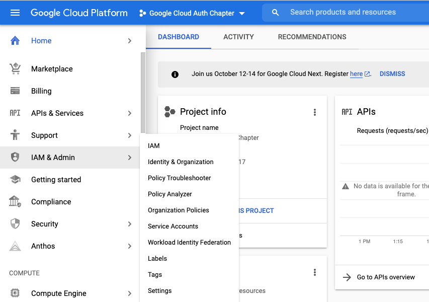

# Google Authorization and R

EcoHealth Alliance regularly uses Google drive, and Google sheets in particular, to
store and collaborate on files. Working with Google's drive based files in R is 
relatively painless thanks to the [`googledrive`](https://googledrive.tidyverse.org/), [`googlesheets4`](https://googlesheets4.tidyverse.org/index.html), and 
[`gargel`](https://gargle.r-lib.org/index.html) packages. 

## Google Drive

The [`googledrive`](https://googledrive.tidyverse.org/) package allows you to
interact with files stored in Google drive from R. You can download, share, delete,
copy, publish and otherwise manipulate files on your drive using this package. 

Package vignettes can be found [here](https://googledrive.tidyverse.org/articles/index.html)

## Google Sheets 

The [`googlesheets4`](https://googlesheets4.tidyverse.org/index.html) package allows
you to directly interact with Google sheets in R. You can read, write, reformat, 
create formulas, and otherwise manipulate the sheet of interest. 

Package vignettes can be found [here](https://googlesheets4.tidyverse.org/articles/index.html)

## Gargle

The [`gargel`](https://gargle.r-lib.org/index.html) package focuses entirely on 
managing credentials for the Google api. Vignettes for the package can be found
[here](https://gargle.r-lib.org/articles/index.html). 

## Setting up non-interactive authentication for Google sheets

We are going to focus on setting up credentials used to automate a workflow in R for Google sheets
that does not require interactive authentication. This largely follows the 
[non-interactive auth vignette](https://gargle.r-lib.org/articles/non-interactive-auth.html). 
But diverges between package based and non-package based projects. 

Basically, to achieve non-interactive auth we want to either provide a token directly or make a token discoverable. 
Remember that tokens, secrets, and api keys should be stored in a secure fashion,
especially if they are going to be pushed to github and used in RSConnect or Github
Actions to automate report generation. 

We are going to follow the recommended (as of 29 September 2021) strategy of 
providing a service account token directly to hand auth. A newer approach called
workload identity federation exists as of writing but is not fully implemented 
in the `gargle` package.  

###  Get a service account and download the token. 

[GCP Service Account Docs](https://cloud.Google.com/iam/docs/service-accounts?_ga=2.215917847.-1040593195.1558621244)

- Setup/View your [Google cloud account](https://console.cloud.Google.com/)
- Create a project on Google cloud to hold your credentials 


- The GCP console is your destination for monitoring and modifying your projects


### Enable APIs

- In the left side, navigate to APIs & Services > Library 

- Choose your api of interest. For this example it is Google sheets.

- Enable the api of interest. *If you need to enable more API's later you can
always come back*


### Billing (?)

Not an issue for sheets or drive but you do need a linked billing account for 
BigQuery and Maps. 

If you're new to GCP as of 29 Sept 2021 you get $300 of credits in the Free
Tier. If you use the $300 in credits GCP will ask for consent before billing. 

### Create a Service Account Token 

- Navigate back to your project homepage
- In the left sidebar go to IAM & Admin > Service Accounts

- Click create service account
- Give it a good name and description

- For Google sheets, we do not need to assign our account service a role
  - Roles can be established to perform tests and otherwise manage the service
  but are not necessary
- Also not necessary to grant user access for this example
  - You may have a need for this with more complicated services
  - It may also be a good idea to get some redundancy in your workflow


### Create a Key

This is what we have been waiting for. Remember that this key will hold very
sensitive information and we should treat it like a username and password combo.

- Click on the appropriate item in the service accounts table. *Notice that it says no key*

- Click on the keys tab, then click on **ADD KEY**

- Select Create new key and download the JSON file. This file can be stored in Keybase, Bitwarden or another encrypted file storage system. 


- You should now see that there is an active key associated with your service account
in the GCP project. 

### Share the Google drive resources of interest with the service account

- **Make sure your sheet is shared with the service account**

Skip ahead to [Provide a service account token for Projects] if you are using the key in a project. 

### Securely managing your tokens for Packages

So now you have this super secret key but need to make it accessible to your
R package. We can use the `sodium` package as well as functions in `gargle` to
password protect the JSON file that stores our key. We can then store the
password as an environmental variable in the project. Notice that we are using
the `:::` in function calls. See [this article](https://gargle.r-lib.org/articles/articles/managing-tokens-securely.html) for more details.

#### Generate a password name

```{r eval=FALSE}
library(sodium)
library(gargle)
library(usethis)

pw_name <- gargle:::secret_pw_name("gargle")

```

#### Generate a random password

***KEEP THIS PASSWORD A SECRET*** 

- See the [Encryption](#encryption) chapter for more information about setting up encryption. You can use Keybase to setup encrypted storage on your machine. 

```{r eval=FALSE}
pw <- gargle:::secret_pw_gen()

#> someSecretComplicatedPassword
```

#### Add PW and PW_NAME to your Environmental variables

- It is strongly recommended that this live in the user level environment to avoid
accidentally passing the variable to a git repo. 
```{r eval=FALSE}
usethis::edit_r_environ(scope = "user")
```

#### Give the env variable to services (Optional)

If you're running this process on a service like [RSConnect](https://blog.rstudio.com/2018/03/02/rstudio-connect-v1-5-14/#:~:text=Environment%20variables%20for%20executable%20content,and%20are%20encrypted%20at%20rest.) or [Github Actions](https://help.github.com/en/actions/configuring-and-managing-workflows/creating-and-storing-encrypted-secrets),
you must provide it to the service. 

#### Encrypt the Secret File

```{r eval=FALSE}
gargle:::secret_write(
  package = "myCoolPackage",
  name = "sheets-demo-key.json",
  input = "keybase://private/myname/longComplicatedFile.json"
)

```

#### Test that you can decrypt

```{r eval=FALSE}
if(gargle:::secret_can_decrypt("myCoolPackage")){
  json<- gargle:::secret_read("sheets-demo-key.json")
  googlesheets4::gs4_auth(path = rawToChar(json))
}
```

### Provide a service account token for Projects

Inspired by the workflow described in [ROpenSci:Security](https://books.ropensci.org/http-testing/security-chapter.html) with additional information from [sodium vignette](https://cran.r-project.org/web/packages/sodium/vignettes/intro.html) and [gargle vignette](https://gargle.r-lib.org/articles/articles/managing-tokens-securely.html).

#### Symetrically encrypt your file

We are creating a secret passphrase to encrypt our very secret token file. Do not publish this code in your repo. 

```{r eval=FALSE}
library(cyphr)
library(sodium)
library(usethis)

## Generate a secret password and store it in you local environment

usethis::edit_r_environ(scope = "user")

## in the .Renviron file
# GOOGLE_AUTH_JSON_PW=Your-Generated-Secret-Passphrase7

get_sodium_key <- function(env_name = "GOOGLE_AUTH_JSON_PW"){

  pw <- Sys.getenv(env_name)

  k <- sodium::hash(charToRaw(pw))

  key <- cyphr::key_sodium(k)

  return(key)

}

key <- get_sodium_key()

dir.create("./inst/tokens",recursive = T)

cyphr::encrypt_file(path = "keybase://private/myname/longComplicatedFile.json",dest = "./inst/tokens/longComplicatedFile.json", key = key)

# to get a string version of the key 
sodium::bin2hex(key$key())


```

#### Provide token to auth function

Point the `gs4_auth` function to the de-encrypted json string

```{r eval=FALSE}
library(googlesheets4)

key <- get_sodium_key()

jsonRaw <- cyphr:::decrypt_file("../inst/tokens/longComplicatedFile.json",key = key)

jsonChar <- rawToChar(jsonRaw)

googlesheets4::gs4_auth(path = jsonChar)

```

### Read in your sheet

**Make sure your sheet is shared with the service account...**

```{r eval=FALSE}

googlesheets4::read_sheet("https://docs.Google.com/spreadsheets/that/i/definitely/shared/with/the/service-account")


```

Additional Resources:
**TODO**

