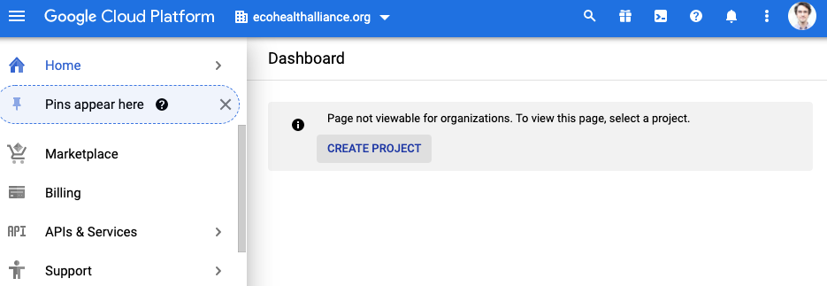
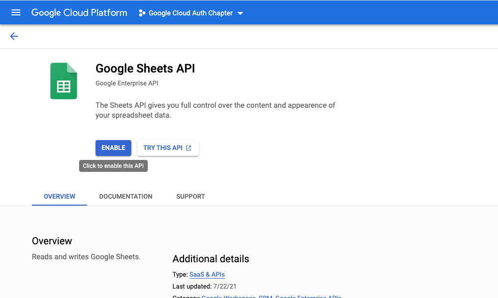
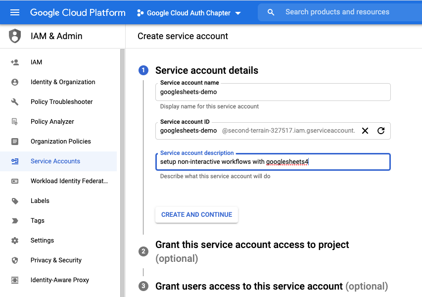
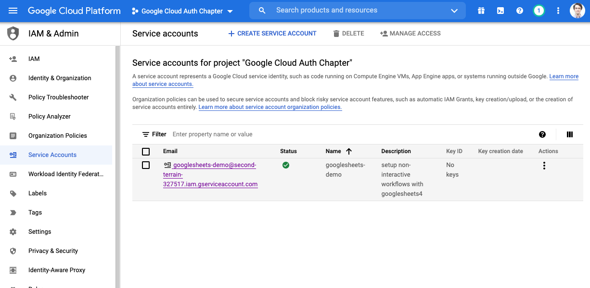
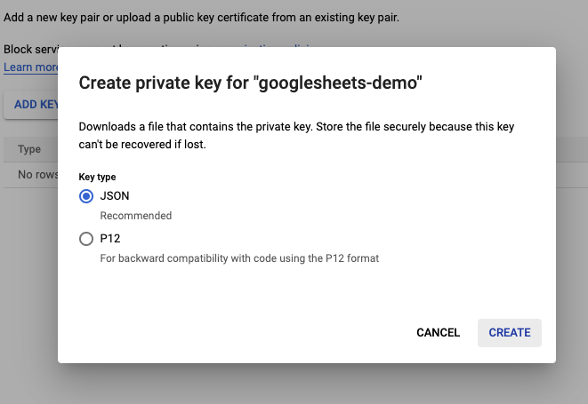

# Google Authorization and R

**IMPORTANT** DO NOT ADD SENSITIVE FILES TO A GITHUB REPO UNTIL THEY ARE ENCRYPTED!

EcoHealth Alliance sometimes uses Google Drive, and Google Sheets in particular, to store and collaborate on data. Working with Google Drive-based files in R is relatively painless thanks to the [`googledrive`](https://googledrive.tidyverse.org/), [`googlesheets4`](https://googlesheets4.tidyverse.org/index.html), and [`gargle`](https://gargle.r-lib.org/index.html) packages.

What is less straightforward is working with drive based files without having to manually authenticate your identity. In this chapter, we will walk through the process of creating credentials with API access that can be used in your R project or package. Ultimately, this could allow you to fully automate your Google-centric data pipelines.

## The basic overview:

0) Create or store something (sheet, csv, doc, etc.) in Google drive
1)  Create a *Google Cloud project* to manage Google services\
2)  Enable the appropriate APIs for the project so it can access things like Drive and Sheets.
3)  Create a *service account* so that you can access the APIs via credentials from R
4)  Encrypt credentials then add them to your R project so that you can still use `git`-based workflows without leaking access to your service account
5)  Share Google-based resources with the service account and check that credentials work as expected from R
6)  Add an encryption key to RStudio Connect or Github as an environment variable so that R can access the resources in automated workflows

## Key Terms

-   **Authentication** - Confirms the identity of an entity
-   **Authorization** - Permits an entity to do something
    -   **Auth** - shorthand for authentication or authorization
-   **Key** or **Token**- Computer-generated credentials that allow for authorization and authentication. In the R-Google universe *key* and *token* are synonyms, though not all services use this way, at at times okens and keys are communicated over the web using different method. You will see these terms used interchangeably in tutorials.
-   **Symmetric encryption** - A type of encryption that uses a single key to encrypt and decrypt an object
-   **Asymmetric encryption** -  A type of encryption that uses public and private keys to encrypt and decrypt an object
-   **Environment variable** - A value stored in a computer's *system environment*. In R, this generally means values stored in the `.Renviron` file, which can be brought into your project using `Sys.getenv("Variable_Name")` and are very useful for storing sensitive information like tokens and keys.
-   **Service** - Functionality provided by another system i.e. serving data via an API.
-   **GCP** - Google cloud platform. Web services from Google.

## Before we start:

*Note*: The preferred method for adding encryption to projects is via `git-crypt`. See chapter \@ref(encryption) for more on `git-crypt`. 


*Credit*: This chapter largely follows the\
[non-interactive auth vignette from the Gargle R package](https://gargle.r-lib.org/articles/non-interactive-auth.html), but diverges for package and non-package focused projects.

*What about Billing?*: Good question. This is not an issue for Google Sheets or Drive APIs but you do need a linked billing account for BigQuery and Maps APIs. If you're new to GCP as of 29 Sept 2021 you get \$300 of credits in the Free Tier. If you use the \$300 in credits GCP will ask for consent before billing. Check with the Data Librarian about using and billing arrangements beyond this.

## Setup encryption tools on your machine

 See chapter \@ref(encryption). This process will take ~30 mins and involves using the command line. 
 
 
## Enable git-crypt on your repository 

Enabling git-crypt requires that your code be stored in a git-backed repository. See chapter \@ref(Version Control, Git and Github) for setting up git repos. 

Enabling `git-crypt` happens from the command line. You can access the [command line directly in Rstudio](https://support.rstudio.com/hc/en-us/articles/115010737148-Using-the-RStudio-Terminal-in-the-RStudio-IDE). If you use rstudio projects and the command line in Rstudio, then the terminal should open in the repo you want to encrypt. 


In the command line run: 

```
# check that you are in the directory with the repo
pwd 
## /Users/MyName/Documents/repo-i-want-to-encrypt

# if you're in the wrong directory, use cd to navigate to the correct repo
# cd ./path/to/repo-i-want-to-encrypt

git-crypt init

```

Next you want to tell git-crypt which files should be encrypted. To do this create a file in the top level directory of your repo called `.gitattributes`. Here you will list the files and folders you would like to encrypt. Each item should be placed a on separate line. To learn more about pattern matching in the `.gitattributes` file, see the [read.me](https://github.com/AGWA/git-crypt#gitattributes-file) and [`.gitignore` manual](https://git-scm.com/docs/gitignore#_pattern_format)


```
.env filter=git-crypt diff=git-crypt
auth/** filter=git-crypt diff=git-crypt
.gitattributes !filter !diff

```

The `.env` file will be used to store environment variables and the `auth/` folder will be used to store keys. Do NOT encrypt the `.gitattributes` file. It maybe a good idea to add your google auth key explicitly to the `.gitattributes` file using this format `**/mySecretKey.json` so that the key is encrypted independent of the directory it is in. 

Next add yourself and other users who will require access to the encrypted files to the repo. The \@ref(encryption) section of the handbook details 
how to add contributors to the repo. 

Finally, you will have to setup a symmetric key for github actions to use. 

In the command line run: 

```
# create the symmetic key
git-crypt export-key git_crypt_key.key

# convert it from binary to bas64 so github can use it
# the file's contents can now be pasted into a github secrety environment variable
cat git_crypt_key.key | base64 | pbcopy

```

Paste the key into [Github's secret environment variable field](https://docs.github.com/en/actions/security-guides/encrypted-secrets) as `GIT_CRYPT_KEY64`. 


## Setting up non-interactive authentication for Google sheets

In this chapter, we will walk through setting up credentials that can be used in R to access Google sheets without manual authentication. To achieve non-interactive authorization, we want to either provide a *token* directly to a service or make a token discoverable for a service. A token is essentially a long password, designed to be exchanged by machines but too long and complexly formatted to be used by people, and often time-limited. Remember that tokens, secrets, and API keys should be stored in a secure fashion (NOT stored in the text of your code or in unencrypted files).

We are going to follow the recommended (as of 29 September 2021) strategy of providing a *service account key* directly to handle authorization. A newer approach called "workload identity federation" exists as of writing but is not fully implemented in the `gargle` package.

### Create a Google cloud platform project

"Google Cloud projects form the basis for creating, enabling, and using all Google Cloud services including managing APIs, enabling billing, adding and removing collaborators, and managing permissions for Google Cloud resources." - [*GCP Docs*](https://cloud.google.com/resource-manager/docs/creating-managing-projects)

We will use a GCP project to access the Google sheets API via a service account. You do not need a profound understanding of GCP projects to setup a service account.

-   Setup/view your [Google cloud account](https://console.cloud.Google.com/)
-   Create a project on Google cloud to hold your credentials  
-   The GCP console is your destination for monitoring and modifying your projects

### Enable APIs

GCP Projects are centered on the idea that a single project will contain a single application. In our case, the application we are creating relies on the Google Sheets API. You can enable API's for our application to access via the APIs & Services menu item.

-   In the left side menu, navigate to APIs & Services > Library 
-   Choose your api of interest. For this example it is Google sheets. 
-   Enable the api of interest. *If you need to enable more API's later you can always come back*.

### Create a Service Account

Service accounts allow applications, like the GCP project we make, to access certain resources they need via authorized API calls. The service account's access can be limited such that it can only access specific resources in a certain way.

Importantly, service accounts are not part of the EHA workspace domain. You have to manually share resources like Google sheets with a service account even if you have provided domain-level access.

[GCP Service Account Docs](https://cloud.google.com/iam/docs/service-accounts)

-   Navigate back to your project homepage
-   In the left sidebar go to IAM & Admin > Service Accounts 
-   Click create service account
-   Give it a good name and description 
-   For Google sheets, we do not need to assign our account service a role
    -   Roles can be established to perform tests and otherwise manage the service but are not necessary
-   Also not necessary to grant user access for this example
    -   You may have a need for this with more complicated services
    -   It may also be a good idea to get some redundancy in your workflow 

### Create a Key for your service account

Keys for Google service accounts are stored in JSON files. Remember that this key will hold very sensitive information and we should treat it like a username and password combo.

-   Click on the appropriate item in the service accounts table. *Notice that it says no key*.

-   Click on the keys tab, then click on **ADD KEY** 

-   Select create new key and download the JSON file. **WARNING:** Do not store this unencrypted key in a shared location (Dropbox, Google Drive, folder connected to a git repository). 

-   You should now see that there is an active key associated with your service account in the GCP project.

### Share the Google drive resources of interest with the service account

-   **Make sure your sheet is shared with the service account**
-   Remember that service accounts do not belong the EHA domain so there will be extra prompts when sharing resources.

## General approach to securely managing keys

This workflow uses the relatively simple approach of symmetric encryption to securely store files on shared resources like a github repository. Symmetric encryption uses a single key to encrypt and decrypt files. In this workflow, the key is generated from a passphrase.

1)  Unencrypted files storing keys for the Google service account should NOT be stored in shared or public locations (Drive, Dropbox, Github Repo)
    -   If possible store in an encrypted volume. Keybase, Bitwarden, and other credential management storage systems generally allow you to store files in an encrypted manner.
2)  Files storing keys for the Google service account only ever enter the project working directory after being encrypted
3)  Encryption keys or the passwords used to generate keys are stored as environment variables and retrieved from `.Renviron`, never hard-coded into scripts.

Skip ahead to [Securely managing your keys for packages](#securely-managing-your-keys-for-packages) if you are using the key in a project that produces a package.

### Provide a service account key for projects

Now you have a secret key for the service account and need to securely access it in an R project. We can use the `sodium` and `gargle` packages to encrypt the JSON file that stores our key, safely store the encrypted file in the R project, and securely store the encryption key as an environment variable. If additional files or data require encryption it is recommended that use the `git-crypt` approached described in chapter \@ref(encryption).

This section was inspired by the workflow described in [ROpenSci:Security](https://books.ropensci.org/http-testing/security-chapter.html) with additional information from the [sodium vignette](https://cran.r-project.org/web/packages/sodium/vignettes/intro.html) and [gargle vignette](https://gargle.r-lib.org/articles/articles/managing-tokens-securely.html).

#### Create and store encryption password

Here we will create an environment variable to store our encryption password.

-   We will store it in the *user-level* `.Renviron` file that is outside of your project repository so it is not accidentally committed to your project.

Creating your password encrypting the key should only need to be done once, then we will write code that makes use of your encrypted key every time it runs.

```{r create_store_pw, eval=FALSE}
library(sodium)
library(gargle)
library(usethis)
library(readr)

## Name of Environment variable

pw_name <- gargle:::secret_pw_name("service_account")
#> SERVICE_ACCOUNT_PASSWORD

## Value of Environment variable

pw <- gargle:::secret_pw_gen()
#> someSecretComplicatedPassword

sprintf("%s=%s",pw_name, pw)
#> SERVICE_ACCOUNT_PASSWORD=someSecretComplicatedPassword

usethis::edit_r_environ(scope = "user")

#### Copy and paste pw_name=pw into .Renviron file ###
# 1 SERVICE_ACCOUNT_PASSWORD=someSecretComplicatedPassword
# 2 

# always leave an empty line at the end of the .Renviron file

```

#### Create encryption key

```{r Create Key, eval=FALSE}

make_sodium_key <- function(env_var_name = "SERVICE_ACCOUNT_PASSWORD"){

  pw <- Sys.getenv(env_name)
  
  # we use scrypt as our hashing function because it makes keys difficult
  # to brute force. 
  k <- sodium::scrypt(charToRaw(pw))
  
  return(k)

}

key <- make_sodium_key()

# The key we just made is binary so it has to be converted to character in order
# to be stored in .Renviron 

sodium::bin2hex(key)

usethis::edit_r_environ(scope = "user")

########### .Renviron file ####################
# 1 SERVICE_ACCOUNT_PASSWORD=someSecretComplicatedPassword
# 2 SERVICE_ACCOUNT_NA_KEY=output_from_bin2hex_function 
# 3

# always leave an empty line at the end of the .Renviron file

```

#### Symmetrically encrypt your file

Now that we have a sodium key stored as an environment variable, we can symmetrically encrypt our JSON file that stores the service account key. The encrypted file will live in `inst/tokens` within your working directory. After the file has been encrypted it is safe to push it to a remote git repository.

```{r Encrypt File, eval=FALSE}

# get your sodium key from the environment variable
get_sodium_key <- function(env_var_name = "SERVICE_ACCOUNT_NA_KEY"){
  k <- sodium::hex2bin(Sys.getenv(env_var_name))
  return(k)
}

key <- get_sodium_key()

# Our encrypted file will live here
dir.create("./inst/tokens",recursive = T)

binJSON <- readr::read_file_raw("My/directory/outside/the/project/service_account_key.json")

cipher <- data_encrypt(msg = binJSON, key = key2,nonce = random(24))

# The encrypted file in inst/tokens is now safe to push to a remote repository
saveRDS(cipher, "./inst/tokens/service_account_key.rds")

```

#### Run your code using encrypted keys

In the code that reads in data from Google, decrypt the credentials then pass them to Google using the `gs4_auth` function:

```{r eval=FALSE}
library(googlesheets4)

key <- get_sodium_key()

service_account_token <- readRDS("./inst/tokens/service_account_key.rds")

jsonRaw <- sodium:::data_decrypt(service_account_token,key = key)

jsonChar <- rawToChar(jsonRaw)

googlesheets4::gs4_auth(path = jsonChar)

```

#### Read in your sheet

-   *Make sure your sheet is shared with the service account if it hasn't been already*

```{r eval=FALSE}

googlesheets4::read_sheet("https://docs.Google.com/spreadsheets/that/i/definitely/shared/with/the/service-account")


```

#### Add Environment Variable to other services

Non-interactive authentication allows us to automate workflows that involve Google sheets on services like Rstudio connect or Github Actions. In either case, it is relatively straight forward to securely add our `SERVICE_ACCOUNT_PASSWORD` environment variables to those services.

See documentation here:

-   [Add env variables to RSConnect](https://blog.rstudio.com/2018/03/02/rstudio-connect-v1-5-14/#:~:text=Environment%20variables%20for%20executable%20content,and%20are%20encrypted%20at%20rest.)
-   [Add secrets to Github Actions](https://help.github.com/en/actions/configuring-and-managing-workflows/creating-and-storing-encrypted-secrets)

### Securely managing your keys for Packages {#securely-managing-your-keys-for-packages}

You can make your secret service account ky accessible to your R package. We will use the `sodium` package as well as functions in `gargle` to encrypt the JSON file that stores the key and securely store the *encryption* key as an environment variable. Notice that we are using the `:::` operator in function calls. See [this article](https://gargle.r-lib.org/articles/articles/managing-tokens-securely.html) for more details.

#### Create and store encryption password

Here we will create an environment variable to store our encryption password.

-   We will store it in the *user-level* `.Renviron` file that is outside of your project repository so it is not accidentally committed to your project.

Creating your password encrypting the key should only need to be done once. The package can then use code that makes use of your encrypted key every time it runs.

```{r eval=FALSE}
library(sodium)
library(gargle)
library(usethis)

## Name of Environment variable

pw_name <- gargle:::secret_pw_name("gargle")
#> GARGLE_PASSWORD

## Value of Environment variable

pw <- gargle:::secret_pw_gen()
#> someSecretComplicatedPassword

sprintf("%s=%s",pw_name, pw)
#> GARGLE_PASSWORD=someSecretComplicatedPassword

usethis::edit_r_environ(scope = "user")

#### in .Renviron file ###
# 1 GARGLE_PASSWORD=someSecretComplicatedPassword
# 2 

# always leave an empty line at the end of the .Renviron file

```

#### Encrypt the Secret File

```{r eval=FALSE}
gargle:::secret_write(
  package = "myCoolPackage",
  name = "sheets-demo-key.json",
  input = "My/directory/outside/the/project/longComplicatedFile.json"
)

```

#### Test that you can decrypt

```{r eval=FALSE}
if(gargle:::secret_can_decrypt("myCoolPackage")){
  json<- gargle:::secret_read("sheets-demo-key.json")
  googlesheets4::gs4_auth(path = rawToChar(json))
}
```

#### Give the env variable to services (Optional)

If the package will be used in services like RStudio Connect or Github Actions, it is relatively straight forward to securely add our `GARGLE_PASSWORD` environment variables to those services.

See documentation here:

-   [Add env variables to RSConnect](https://blog.rstudio.com/2018/03/02/rstudio-connect-v1-5-14/#:~:text=Environment%20variables%20for%20executable%20content,and%20are%20encrypted%20at%20rest.)
-   [Add secrets to Github Actions](https://help.github.com/en/actions/configuring-and-managing-workflows/creating-and-storing-encrypted-secrets)

## Additional Resources

### Google Drive

The [`googledrive`](https://googledrive.tidyverse.org/) package allows you to interact with files stored in Google drive from R. You can download, share, delete, copy, publish and otherwise manipulate files on your drive using this package.

Package vignettes can be found [here](https://googledrive.tidyverse.org/articles/index.html)

### Google Sheets

The [`googlesheets4`](https://googlesheets4.tidyverse.org/index.html) package allows you to directly interact with Google sheets in R. You can read, write, reformat, create formulas, and otherwise manipulate the sheet of interest.

Package vignettes can be found [here](https://googlesheets4.tidyverse.org/articles/index.html)

###  Gargle

The [`gargle`](https://gargle.r-lib.org/index.html) package focuses entirely on managing credentials for the Google api. Vignettes for the package can be found [here](https://gargle.r-lib.org/articles/index.html).
